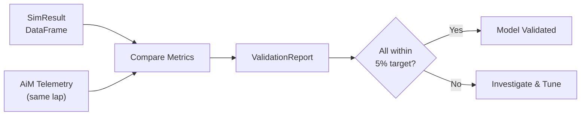

# Data Flow

How data moves from raw files through the simulation to results and visualization.

---

## End-to-End Pipeline

```mermaid
flowchart TD
    subgraph Raw["Raw Data Files"]
        AiM["AiM CSV<br/>37k rows x 114 channels<br/>20 Hz telemetry"]
        Voltt["Voltt CSV<br/>18k rows x 13 columns<br/>Cell + Pack level"]
        YAML["Vehicle YAML<br/>ct16ev.yaml / ct17ev.yaml"]
        BMS["Endurance Tune2.txt<br/>BMS discharge limits"]
    end

    subgraph Loaders["Data Loading"]
        LA["load_aim_csv()<br/>Parse metadata + data"]
        LV["load_voltt_csv()<br/>Strip comments, parse"]
        LY["VehicleConfig.from_yaml()<br/>Parse + validate"]
    end

    subgraph Calibration["Model Calibration"]
        CAL["BatteryModel.calibrate()<br/>Fit OCV + R_int curves<br/>from Voltt data"]
        TRK["Track.from_telemetry()<br/>Extract lap geometry<br/>from GPS data"]
        RPL["ReplayStrategy.from_aim_data()<br/>Extract driver behavior"]
    end

    subgraph Simulation["Simulation Run"]
        ENG["SimulationEngine.run()<br/>~240 segments/lap<br/>~1-22 laps"]
    end

    subgraph Results["Output"]
        DF["SimResult.states<br/>DataFrame: per-segment<br/>24 columns"]
        SUM["Summary Metrics<br/>time, energy, SOC, laps"]
        VAL["ValidationReport<br/>sim vs. telemetry errors"]
    end

    AiM --> LA
    Voltt --> LV
    YAML --> LY
    LA --> TRK & RPL
    LV --> CAL
    LY --> ENG
    CAL --> ENG
    TRK --> ENG
    RPL --> ENG
    ENG --> DF & SUM
    DF --> VAL

    style Raw fill:#2d4a22,stroke:#4a7c34
    style Loaders fill:#1a3a5c,stroke:#2d6da3
    style Calibration fill:#5c3a1a,stroke:#a36d2d
    style Simulation fill:#5c1a3a,stroke:#a32d6d
    style Results fill:#3a1a5c,stroke:#6d2da3
```



---

## Data Formats

### AiM Telemetry CSV Structure

```
"Format","AiM CSV File"            ← metadata section
"Venue","MichiganS MI"              (key-value pairs)
"Vehicle","CT-16EV"
...
                                    ← blank line separator
Time,GPS Speed,RPM,...              ← column headers
s,km/h,rpm,...                      ← units row
                                    ← blank line
"0.000","0.00","0.0",...           ← data rows (quoted)
"0.050","0.12","0.0",...
```

> [!note] Special Handling
> The `load_aim_csv()` function detects the metadata/data boundary automatically. Units are stored in `df.attrs['units']` for later reference.

### Voltt Battery CSV Structure

```
# Simulation ID: e73a8007-...      ← comment lines (# prefix)
# Pack: 110S 4P
# Cell: Molicel P45B
...
Time [s],Voltage [V],SOC [%],...   ← headers with units
0.0,4.185,100.0,...                ← data (unquoted)
0.1,4.183,99.99,...
```

### Vehicle Config YAML

```yaml
name: CT-16EV
year: 2025
vehicle:
  mass_kg: 288.0          # includes 68 kg driver
  frontal_area_m2: 1.0
  drag_coefficient: 1.502
  rolling_resistance: 0.015
  wheelbase_m: 1.53
powertrain:
  motor_speed_max_rpm: 2900
  # ... (see ct16ev.yaml)
battery:
  cell_type: "P45B"
  topology: { series: 110, parallel: 4 }
  # ... (see ct16ev.yaml)
```

---

## SimResult DataFrame Columns

The simulation outputs one row per segment with these columns:

| Column | Unit | Description |
|--------|------|-------------|
| `lap` | — | Lap number (0-indexed) |
| `segment_idx` | — | Segment index within lap |
| `time_s` | s | Cumulative elapsed time |
| `distance_m` | m | Cumulative distance |
| `speed_ms` | m/s | Vehicle speed at segment exit |
| `speed_kmh` | km/h | Speed in km/h |
| `soc_pct` | % | State of charge |
| `pack_voltage_v` | V | Battery terminal voltage |
| `pack_current_a` | A | Battery current (+ = discharge) |
| `cell_temp_c` | °C | Cell temperature |
| `motor_rpm` | rpm | Motor speed |
| `motor_torque_nm` | Nm | Motor torque |
| `electrical_power_w` | W | Power at battery (+ = discharge) |
| `drive_force_n` | N | Tractive force at wheels |
| `regen_force_n` | N | Regenerative braking force |
| `resistance_force_n` | N | Total drag + rolling + grade |
| `net_force_n` | N | Net longitudinal force |
| `segment_time_s` | s | Time spent in this segment |
| `action` | — | THROTTLE / COAST / BRAKE |
| `throttle_pct` | 0-1 | Throttle pedal fraction |
| `brake_pct` | 0-1 | Brake pedal fraction |
| `curvature` | 1/m | Segment curvature |
| `corner_speed_limit_ms` | m/s | Max speed from lateral grip |
| `grade` | — | Segment grade (rise/run) |

---

## Validation Data Flow



**Validated metrics:**
| Metric | Target Error |
|--------|-------------|
| Lap time | < 5% |
| Mean speed | < 5% |
| Peak speed | < 10% |
| SOC consumed | < 15% |
| Mean pack voltage | < 5% |
| Mean pack current | < 20% |
