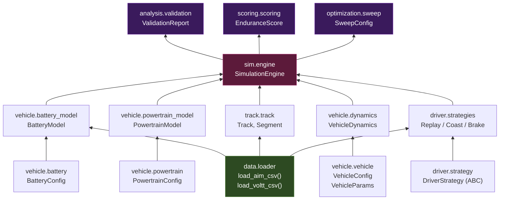

# Module Dependencies

How the simulation modules depend on each other.

---

## Dependency Graph



---

## Module Responsibility Matrix

| Module | Reads | Produces | Depends On |
|--------|-------|----------|------------|
| `data.loader` | CSV files | DataFrames | — (standalone) |
| `vehicle.vehicle` | YAML configs | VehicleConfig | battery, powertrain configs |
| `vehicle.battery` | — | BatteryConfig | — (pure config) |
| `vehicle.battery_model` | Voltt CSV (via loader) | OCV/R curves, state updates | BatteryConfig, loader |
| `vehicle.powertrain` | — | PowertrainConfig | — (pure config) |
| `vehicle.powertrain_model` | — | Torque/speed/power maps | PowertrainConfig |
| `vehicle.dynamics` | — | Forces, cornering speeds | VehicleParams |
| `track.track` | AiM CSV (via loader) | Segment list | loader |
| `driver.strategy` | — | ABC interface | track.Segment |
| `driver.strategies` | AiM CSV (via loader) | Control commands | strategy, dynamics, loader |
| `sim.engine` | All models + track + strategy | SimResult DataFrame | All above |
| `analysis.validation` | SimResult + AiM telemetry | ValidationReport | loader, engine output |

---

## Import Map

```
src/fsae_sim/
├── data/loader.py          → imported by: battery_model, track, strategies, validation
├── vehicle/
│   ├── vehicle.py          → imported by: engine (via __init__)
│   ├── battery.py          → imported by: battery_model, vehicle.py
│   ├── battery_model.py    → imported by: engine
│   ├── powertrain.py       → imported by: powertrain_model, vehicle.py
│   ├── powertrain_model.py → imported by: engine
│   └── dynamics.py         → imported by: engine, strategies
├── track/track.py          → imported by: engine
├── driver/
│   ├── strategy.py         → imported by: strategies, engine
│   └── strategies.py       → imported by: engine (user code)
└── sim/engine.py           → imported by: user code, validation
```

> [!tip] Key Design Principle
> **Config objects are frozen dataclasses** (immutable). Runtime models are mutable classes that take configs as constructor arguments. This separation means you can create one config and pass it to multiple model instances for parallel parameter sweeps.
