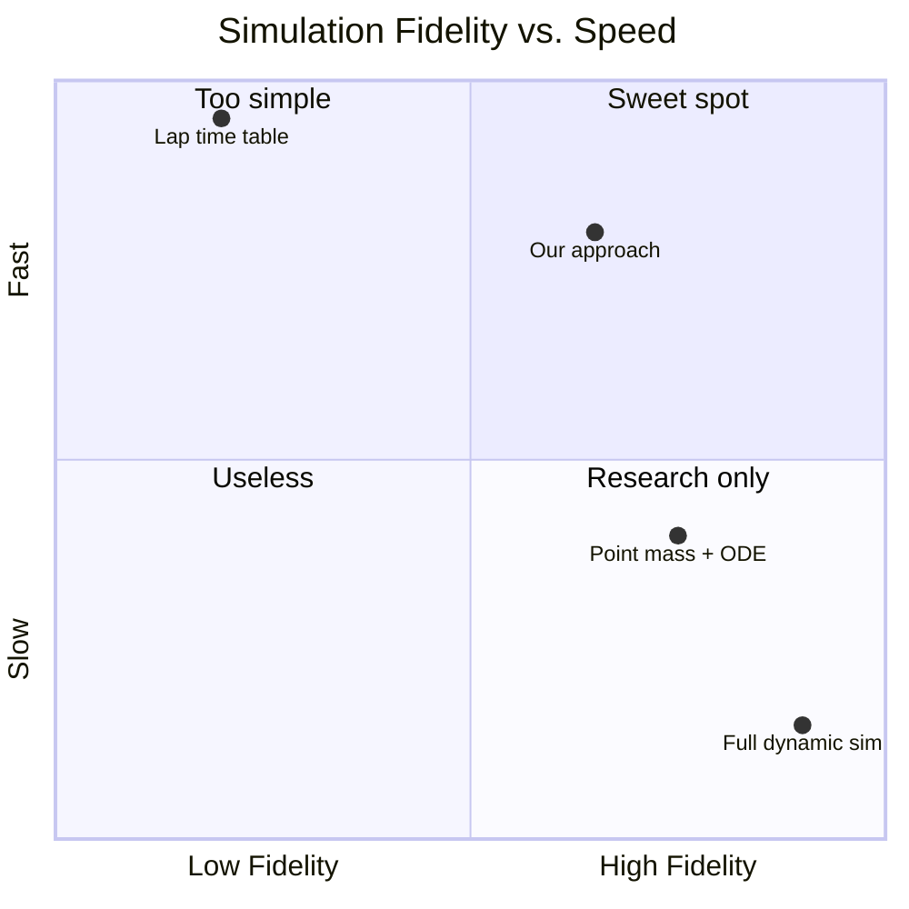

# System Overview

> [!info] Core Idea
> A **quasi-static simulation** that steps through discrete track segments, computing forces, speeds, power draw, and battery state at each point — trading real-time fidelity for computational speed so we can run thousands of parameter sweeps.

---

## Why This Approach?

We use a **quasi-static** model — not a full dynamic vehicle simulation, not a simple lookup table. Each 5-meter track segment is solved as a steady-state force balance, which gives us:

- **Enough physics** to capture battery SOC depletion, thermal limits, motor torque curves, and aero effects
- **Fast enough** to sweep hundreds of parameter combinations in minutes
- **Validated** against real telemetry from the 2025 Michigan endurance event

---

## High-Level Architecture

```mermaid
flowchart TB
    subgraph Input["Input Layer"]
        YAML["Vehicle Config<br/>(YAML)"]
        AiM["AiM Telemetry<br/>(CSV)"]
        Voltt["Voltt Battery Sim<br/>(CSV)"]
    end

    subgraph Models["Physics Models"]
        BAT["Battery Model<br/>Equivalent Circuit"]
        PT["Powertrain Model<br/>Torque/Speed/Power"]
        DYN["Vehicle Dynamics<br/>Force Balance"]
        TRK["Track Model<br/>Geometry Segments"]
        DRV["Driver Strategy<br/>Throttle/Coast/Brake"]
    end

    subgraph Engine["Simulation Engine"]
        SIM["SimulationEngine.run()<br/>Segment-by-segment loop"]
    end

    subgraph Output["Output Layer"]
        RES["SimResult<br/>DataFrame + Metrics"]
        VAL["Validation<br/>vs. Telemetry"]
        DASH["Dashboard<br/>(Dash/Plotly)"]
    end

    YAML --> BAT & PT & DYN
    Voltt --> BAT
    AiM --> TRK & DRV
    BAT & PT & DYN & TRK & DRV --> SIM
    SIM --> RES
    RES --> VAL & DASH

    style Input fill:#2d4a22,stroke:#4a7c34
    style Models fill:#1a3a5c,stroke:#2d6da3
    style Engine fill:#5c3a1a,stroke:#a36d2d
    style Output fill:#3a1a5c,stroke:#6d2da3
```

---

## The Simulation Loop

For each lap, for each 5-meter segment:

| Step | What Happens | Key Module |
|------|-------------|------------|
| 1 | Driver sees upcoming 5 segments, decides throttle/coast/brake | [[Driver Strategies]] |
| 2 | Compute drive force, regen force, resistance forces | [[Vehicle Dynamics]], [[Powertrain Model]] |
| 3 | Kinematic equation: $v_{exit}^2 = v_{entry}^2 + 2ad$, clamped to corner limit | [[Vehicle Dynamics]] |
| 4 | Motor torque x omega / efficiency = electrical power | [[Powertrain Model]] |
| 5 | Clamp current to BMS discharge limit (temp + SOC dependent) | [[Battery Model]] |
| 6 | Coulomb counting for SOC, I²R for temperature | [[Battery Model]] |
| 7 | Append row to results DataFrame, advance state | [[Simulation Engine]] |

---

## Termination Conditions

The simulation stops early if:

> [!danger] Battery Dead
> SOC drops to **2%** (discharged_soc_pct) — the BMS will cut power

> [!danger] Thermal Shutdown
> Cell temperature reaches **65°C** — discharge current goes to 0A

---

## Design Decisions

| Decision | Choice | Rationale |
|----------|--------|-----------|
| Fidelity level | Quasi-static + empirical corrections | Fast enough for sweeps, accurate enough for 5% validation |
| Track source | GPS-extracted from Michigan 2025 | Only track we have data for; can add others later |
| Segment size | 5 meters | Balances resolution vs. computation (~240 segments/lap) |
| Battery model | Equivalent circuit (OCV - IR) | Matches Voltt data, captures SOC/temp effects |
| Driver model | Strategy pattern with lookahead | Supports replay from telemetry AND synthetic strategies |
| Time integration | Forward Euler per segment | Adequate for 5m steps at FSAE speeds |

---

## What's NOT Modeled (Yet)

- **Tire slip / lateral load transfer** — point mass assumes infinite grip up to 1.3g lateral limit
- **Suspension dynamics** — no pitch/roll/heave
- **Active cooling** — 2025 car has no cooling; 2026 data includes h=50 W/m²K but not yet integrated
- **Transient electrical effects** — no inverter switching losses, no cable resistance
- **Multi-lap thermal soak** — thermal model resets between laps (todo)

See also: [[Quasi-Static Simulation]] for the physics behind this approach.
