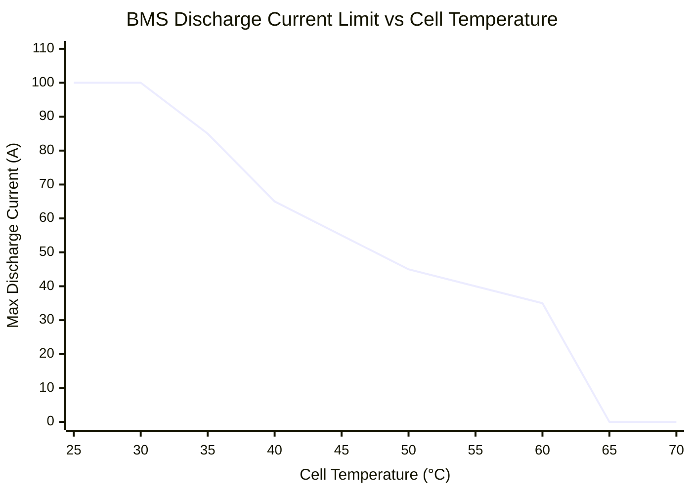

# BMS Configuration

> [!summary]
> Battery Management System parameters from `Endurance Tune2.txt` — the actual BMS configuration loaded into the CT-16EV for the 2025 endurance event.

**Source:** `Real-Car-Data-And-Stats/Endurance Tune2.txt`

---

## Discharge Limits (Temperature-Dependent)

The BMS enforces a maximum discharge current based on cell temperature:



| Cell Temp (°C) | Max Current (A) | Notes |
|---------------|-----------------|-------|
| ≤ 30 | 100 | Full power |
| 35 | 85 | 15% reduction |
| 40 | 65 | 35% reduction |
| 45 | 55 | 45% reduction |
| 50 | 45 | 55% reduction |
| 55 | 40 | 60% reduction |
| 60 | 35 | 65% reduction |
| 65 | **0** | **Complete cutoff** |

> [!danger] The 65°C Cliff
> At 65°C the BMS cuts all discharge current to zero. The car **cannot move**. In an endurance run, this means DNF. The [[Battery Model]] enforces this as a simulation termination condition.

---

## SOC Taper

Below a threshold SOC, the BMS progressively reduces allowed discharge current:

$$I_{max} = I_{base} - (threshold - SOC) \times rate$$

| Parameter | Value |
|-----------|-------|
| Threshold | 85% SOC |
| Rate | 1.0 A per 1% SOC below threshold |

**Example at 30°C:**

| SOC | Base Current | Taper Reduction | Effective Max |
|-----|-------------|-----------------|---------------|
| 100% | 100 A | 0 A | 100 A |
| 85% | 100 A | 0 A | 100 A |
| 70% | 100 A | 15 A | 85 A |
| 50% | 100 A | 35 A | 65 A |
| 30% | 100 A | 55 A | 45 A |
| 10% | 100 A | 75 A | 25 A |

> [!note] Combined Effect
> At low SOC AND high temperature, both limits stack. For example at 50°C and 50% SOC: temp limit = 45A, SOC taper = 65A → effective = **45A** (minimum wins).

---

## Cell Voltage Bounds

| Parameter | Value | Unit |
|-----------|-------|------|
| Maximum cell voltage | 4.195 | V |
| Minimum cell voltage | 2.55 | V |
| Discharged SOC | 2 | % |

The minimum cell voltage creates an additional current limit — the [[Battery Model]] calculates the maximum current that won't drive any cell below 2.55V:

$$I_{max,V} = \frac{V_{OCV}(SOC) - 2.55}{R_{int}(SOC)}$$

---

## Inverter / Motor Limits

| Parameter | Value | Unit |
|-----------|-------|------|
| Inverter IQ (torque-producing) | 170 | A |
| Inverter ID (field-weakening) | 30 | A |
| Torque limit (inverter) | 85 | Nm |
| Torque limit (LVCU) | 150 | Nm |
| Motor speed target | 2900 | RPM |
| Brake speed (field weakening start) | 2400 | RPM |

> [!info] Two Torque Limits
> The **inverter** limits torque to 85 Nm based on its current rating. The **LVCU** has a mechanical safety limit of 150 Nm. Under normal operation, the 85 Nm inverter limit is always binding.

---

## How BMS Config Maps to Code

```
Endurance Tune2.txt → configs/ct16ev.yaml → BatteryConfig → BatteryModel
                                           → PowertrainConfig → PowertrainModel
```

Every value in the BMS configuration has a direct counterpart in the vehicle YAML config and simulation code.

See also: [[Battery Model]], [[CT-16EV (2025)]], [[Powertrain Model]]
