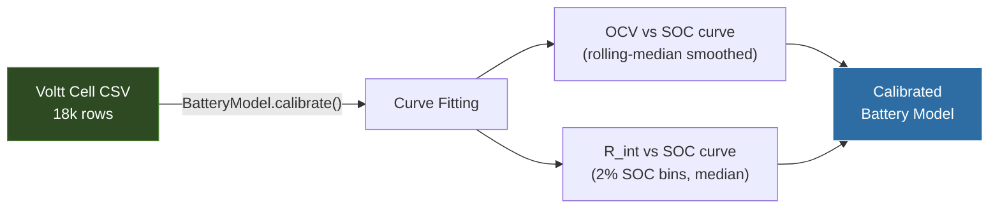

# Battery Simulation Data

> [!summary]
> Voltt (About:Energy) battery simulation exports for **both** the 2025 P45B pack and the 2026 P50B pack. These calibrate the [[Battery Model]] and provide ground-truth thermal/electrical behavior.

---

## Available Datasets

| Dataset | Pack | Cells | Cooling | Location |
|---------|------|-------|---------|----------|
| **2025 Pack** | 110S4P Molicel P45B | 440 total | None (h=0) | `About-Energy-Volt-Simulations-2025-Pack/` |
| **2026 Pack** | 100S4P Molicel P50B | 400 total | Active (h=50 W/m²K) | `About-Energy-Volt-Simulations-2026/` |

Each dataset includes:
- `*_cell.csv` — Single-cell level values (one representative cell)
- `*_pack.csv` — Pack-scaled values (voltage × series, current × parallel)
- `simulation_info.txt` — Configuration metadata

---

## 2025 Pack Simulation (P45B)

| Property | Value |
|----------|-------|
| Simulation ID | `e73a8007-836e-47ef-8a8f-2fccfd36651f` |
| Export Date | April 13, 2026 |
| Cell | Molicel P45B (4.5 Ah) |
| Topology | 110S4P |
| Data points | 18,264 rows |
| Time step | 0.1 s |
| Duration | ~1,826 s (~30.4 min) |
| Initial SOC | 100% |
| Initial Temp | 25°C |
| Ambient Temp | 25°C |
| Cooling | **None** (h = 0 W/m²K) |
| Min voltage cutoff | 2.5 V |
| Max temp cutoff | 80°C |

> [!warning] Peak Exceedances
> - Peak current: **65.1 A** (exceeded 45 A continuous limit)
> - Peak power: **26,800 W** (exceeded 162 W/cell continuous limit)
> 
> These peaks represent burst discharge during acceleration — within the cell's pulse rating but above continuous limits.

---

## 2026 Pack Simulation (P50B)

| Property | Value |
|----------|-------|
| Simulation ID | `1f472763-f455-461d-bd19-828d00beae48` |
| Cell | Molicel P50B (5.0 Ah) |
| Topology | 100S4P |
| Data points | 18,264 rows |
| Duration | ~1,826 s |
| Ambient Temp | 25°C |
| Cooling | **Active** (h = 50 W/m²K) |
| Peak current | 72.7 A (exceeded 60 A continuous) |
| Peak power | 26,800 W (exceeded 216 W/cell continuous) |

> [!tip] Key Difference
> The 2026 simulation includes **active cooling** — this dramatically affects thermal behavior and allows sustained higher power operation.

---

## CSV Columns (Same for Both)

| Column | Unit | Cell-Level Description | Pack-Level Scaling |
|--------|------|----------------------|-------------------|
| Time | s | Simulation time | Same |
| Voltage | V | Cell terminal voltage | × 110 (2025) or × 100 (2026) |
| SOC | % | State of charge | Same |
| Power | W | Cell power | × 440 (2025) or × 400 (2026) |
| Current | A | Cell current | × 4 (parallel) |
| Charge | Ah | Cumulative charge | × 4 |
| OCV | V | Open-circuit voltage | × series |
| Temperature | °C | Cell temperature | Same |
| Heat Generation | W | Total heat produced | × cells |
| Cooling Power | W | Active cooling removal | × cells |
| Resistive Heat | W | I²R losses | × cells |
| Reversible Heat | W | Entropic heat | × cells |
| Hysteresis Heat | W | Hysteresis losses | × cells |

---

## How Voltt Data Calibrates the Battery Model

**OCV extraction:** Direct from Voltt `OCV [V]` column (smoothed)

**Internal resistance extraction:**
$$R_{int} = \frac{V_{OCV} - V_{terminal}}{|I_{discharge}|}$$
- Only discharge samples used (I > 0)
- Binned into 2% SOC windows
- Median per bin (robust to outliers)

---

## Data Ranges (2025 Pack — End State)

| Metric | Start | End |
|--------|-------|-----|
| SOC | 100% | ~57% |
| Cell Voltage | ~4.19 V | ~3.75 V |
| Pack Voltage | ~461 V | ~413 V |
| Temperature | 25°C | ~33°C |

> [!note] The Voltt simulation runs on a standardized duty cycle matching the endurance event duration (~30 min). The end SOC of ~57% suggests the simulation uses a representative but not exact power profile.

See also: [[Battery Model]], [[Battery Physics]], [[BMS Configuration]]
