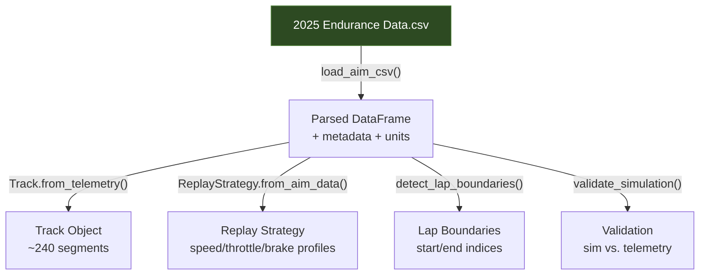

# Telemetry Data

> [!summary]
> Real race telemetry from the **2025 Michigan FSAE Endurance** event, recorded by an AiM data logger at 20 Hz across 114 channels.

**File:** `Real-Car-Data-And-Stats/2025 Endurance Data.csv`

---

## Session Details

| Property | Value |
|----------|-------|
| Event | FSAE Michigan 2025 |
| Date | Saturday, June 21, 2025 |
| Time | 12:25 PM |
| Vehicle | CT-16EV |
| Driver | EV Endurance 2025 |
| Sample rate | 20 Hz |
| Duration | ~1,859 s (~31 min) |
| Total rows | 37,196 |
| Total channels | 114 |

---

## Channel Groups

### Speed & Position (Primary Simulation Inputs)

| Channel | Unit | Use in Simulation |
|---------|------|-------------------|
| `GPS Speed` | km/h | Ground truth speed, track extraction |
| `GPS Latitude` | deg | Start/finish detection, track geometry |
| `GPS Longitude` | deg | Start/finish detection |
| `GPS LatAcc` | g | Curvature calculation |
| `GPS LonAcc` | g | Braking/acceleration reference |
| `GPS Slope` | deg | Grade extraction |
| `GPS Radius` | m | Curvature (10000 = straight/uncertain) |
| `GPS Altitude` | m | Elevation reference |
| `Distance on GPS Speed` | m | Cumulative distance |

### Powertrain

| Channel | Unit | Use in Simulation |
|---------|------|-------------------|
| `RPM` | rpm | Motor speed validation |
| `Torque Command` | Nm | Requested torque |
| `Torque Feedback` | Nm | Actual delivered torque |
| `LVCU Torque Req` | Nm | LVCU torque request → [[Driver Strategies\|ReplayStrategy]] |
| `MCU DC Current` | A | Inverter DC current draw |
| `Phase A/B/C Current` | A | Motor phase currents |
| `Id Feedback` | A | d-axis current |
| `Iq Feedback` | A | q-axis current |

### Driver Inputs

| Channel | Unit | Use in Simulation |
|---------|------|-------------------|
| `Throttle Pos` | % | Driver throttle → [[Driver Strategies\|ReplayStrategy]] |
| `FBrakePressure` | bar | Front brake pressure |
| `RBrakePressure` | bar | Rear brake pressure |
| `BrakeBias` | % | Front/rear bias |

### Battery / BMS

| Channel | Unit | Use in Simulation |
|---------|------|-------------------|
| `Pack Voltage` | V | Terminal voltage validation |
| `Pack Current` | A | Current draw validation |
| `State of Charge` | % | SOC validation |
| `Pack Temp` | °C | Cell temperature validation |
| `Min Cell Voltage` | mV | Cell-level monitoring |
| `BMS Disch Lim` | A | Active discharge limit |
| `BMS Disch Enable` | # | BMS enable flag |

### Vehicle Dynamics (IMU)

| Channel | Unit | Description |
|---------|------|-------------|
| `InlineAcc` | g | Longitudinal acceleration |
| `LateralAcc` | g | Lateral acceleration |
| `VerticalAcc` | g | Vertical acceleration |
| `RollRate` | deg/s | Roll angular velocity |
| `PitchRate` | deg/s | Pitch angular velocity |
| `YawRate` | deg/s | Yaw angular velocity |

### Fault Flags (Boolean)

```
RTD Fault, BSE Fault, TPS1 OOR Fault, TPS2 OOR Fault,
APPS Dist Fault, DC Undervoltage, InverterTempHi,
InverterTempLo, MCU LV Out of Range, MotorOverTemp,
MotorOverSpeed, InvOverVolt, HWOverCurrent, CANCommandLost
```

> [!note] Fault channels are useful for identifying periods where the car was power-limited or had intermittent issues during the endurance run.

---

## Data Quality Notes

> [!warning] GPS Artifacts
> - **PosAccuracy = 200 mm** indicates cold-start GPS — filter these rows
> - **GPS Radius = 10000 m** means AiM couldn't determine curvature — treat as straight
> - **GPS Speed < 5 km/h** includes pit stops and staging — filter for lap analysis

---

## How This Data Is Used



See also: [[Data Loaders]], [[Track Module]], [[Driver Strategies]], [[Analysis Module]]
