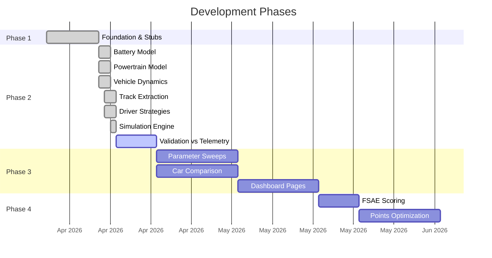

# FSAE EV Endurance Simulation

> [!abstract] Project Overview
> A physics-based endurance simulation for **UConn Formula SAE Electric** — predicting lap times, energy consumption, and competition points to optimize vehicle configuration and driver strategy for the CT-16EV (2025) and CT-17EV (2026) cars.

---

## Quick Navigation

### Architecture & Design
- [[System Overview]] — High-level architecture and simulation approach
- [[Data Flow]] — How data moves through the simulation pipeline
- [[Module Dependencies]] — Dependency graph between all modules

### Simulation Modules
| Module | Description | Status |
|--------|-------------|--------|
| [[Vehicle Module]] | Config loading, vehicle parameters | Complete |
| [[Battery Model]] | Equivalent-circuit runtime model | Complete |
| [[Powertrain Model]] | Motor/inverter/gearbox model | Complete |
| [[Vehicle Dynamics]] | Force-balance with 4-wheel Pacejka tire model | Complete |
| [[Track Module]] | Track geometry from GPS telemetry | Complete |
| [[Driver Strategies]] | Control strategies (replay, coast, brake, CalibratedStrategy) | Complete |
| [[Simulation Engine]] | Main simulation loop orchestration | Complete |
| [[Data Loaders]] | CSV parsers for AiM and Voltt data | Complete |
| [[Analysis Module]] | Validation and post-processing (~2% energy error, 8/8 metrics pass) | Partial |
| [[Scoring Module]] | FSAE endurance/efficiency scoring | Stub |
| [[Dashboard]] | Dash/Plotly web visualization | Stub |

### Vehicle Data
- [[CT-16EV (2025)]] — The 2025 competition car (real telemetry available)
- [[CT-17EV (2026)]] — The 2026 design target car
- [[Vehicle Comparison]] — Side-by-side parameter comparison

### Data Assets
- [[Telemetry Data]] — AiM race logs from 2025 Michigan Endurance
- [[Battery Simulation Data]] — Voltt cell/pack simulations for both packs
- [[BMS Configuration]] — Discharge limits, SOC taper, voltage bounds

### Physics Reference
- [[Quasi-Static Simulation]] — The simulation methodology explained
- [[Battery Physics]] — Equivalent-circuit model, OCV, internal resistance
- [[Motor Torque Curve]] — Constant-torque and field-weakening regions
- [[Aerodynamic Forces]] — Drag, rolling resistance, grade forces

### Project Info
- [[Getting Started]] — How to set up and run the simulation
- [[Roadmap]] — 4-phase development plan and current status
- [[Glossary]] — Key terms and abbreviations

---

## Project Status



---

> [!tip] Getting Started
> Open a terminal and run:
> ```bash
> pip install -e ".[dev]"
> pytest tests/
> ```
> See [[Getting Started]] for full setup instructions including Docker.
