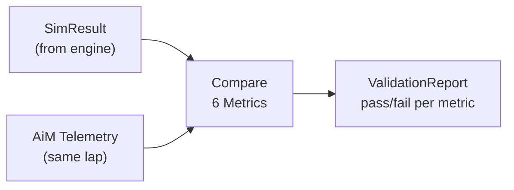

# Analysis Module

> [!summary]
> Post-processing and validation tools — comparing simulation output against real telemetry and computing performance metrics.

**Source:** `src/fsae_sim/analysis/validation.py`, `src/fsae_sim/analysis/metrics.py`

---

## Validation System

The validation module answers the critical question: **does the simulation match reality?**



### Validated Metrics

| Metric | Target Error | Why This Threshold |
|--------|-------------|-------------------|
| **Lap time** | < 5% | Primary output — must be accurate |
| **Mean speed** | < 5% | Drives lap time and energy |
| **Peak speed** | < 10% | Relaxed — GPS noise at high speed |
| **SOC consumed** | < 15% | Battery model validation |
| **Mean pack voltage** | < 5% | OCV curve accuracy |
| **Mean pack current** | < 20% | Most uncertain — driver behavior |

### ValidationMetric

```python
@dataclass
class ValidationMetric:
    name: str           # e.g., "Lap Time"
    unit: str           # e.g., "s"
    telemetry_value: float
    simulation_value: float
    absolute_error: float
    relative_error_pct: float
    target_pct: float   # e.g., 5.0
    passed: bool        # relative_error < target
```

### ValidationReport

```python
report = validate_simulation(sim_states, aim_df, lap_start, lap_end)
print(report.summary())
# Validation Report: 5/6 metrics passed
# ✓ Lap Time: 65.2s (sim) vs 64.8s (tel) — 0.6% error [target: 5%]
# ✓ Mean Speed: 18.4 m/s vs 18.5 m/s — 0.5% error [target: 5%]
# ...
```

---

## Lap Boundary Detection

The `detect_lap_boundaries()` function finds complete laps in AiM data:

1. Filter to moving samples (GPS Speed > 5 km/h)
2. Find latitude crossings of median (start/finish line proxy)
3. Filter by longitude band (±0.001°) for consistency
4. Return (start_idx, end_idx, lap_distance_m) for each detected lap

---

## Metrics Module (Stubs)

These functions are planned for Phase 3:

| Function | Description | Status |
|----------|-------------|--------|
| `compute_lap_times(states)` | Extract time per lap from DataFrame | Stub |
| `compute_energy_per_lap(states)` | Energy consumed per lap | Stub |
| `compute_pareto_frontier(results)` | Time vs. energy Pareto front | Stub |

See also: [[Data Flow]], [[Simulation Engine]], [[Telemetry Data]]
