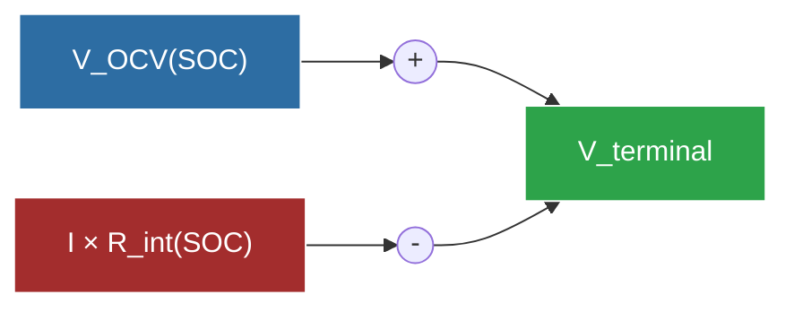
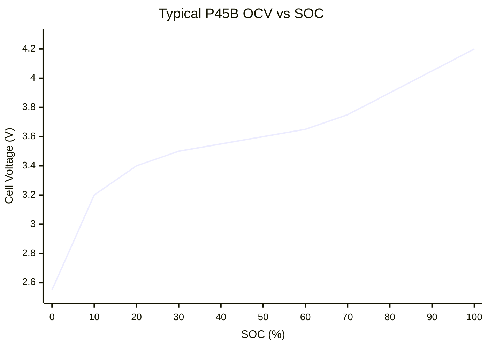
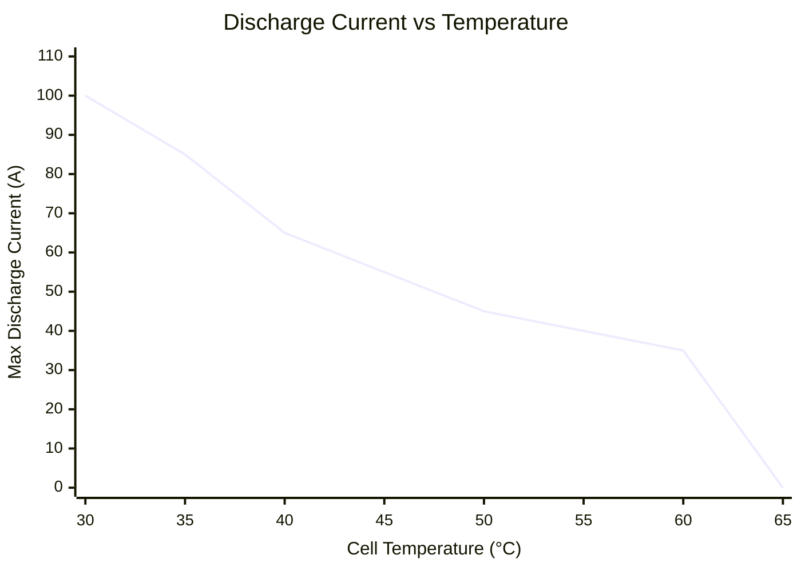

# Battery Model

> [!summary]
> An **equivalent-circuit battery model** calibrated against Voltt cell simulation data. Models open-circuit voltage, internal resistance, thermal behavior, and BMS discharge limits.

**Source:** `src/fsae_sim/vehicle/battery_model.py`

---

## How It Works

The battery model uses a simple but effective equivalent circuit:

$$V_{terminal} = V_{OCV}(SOC) - I \cdot R_{int}(SOC)$$

Where:
- $V_{OCV}$ = Open-circuit voltage (function of SOC, from Voltt data)
- $I$ = Discharge current (positive = discharging)
- $R_{int}$ = Internal resistance (function of SOC, from Voltt data)



---

## Calibration from Voltt Data

The model is **not usable until calibrated** against Voltt simulation data. Calibration extracts two curves:

### OCV Curve
- Extracted directly from Voltt `OCV [V]` column
- Smoothed with rolling-median filter
- Monotonically increasing with SOC (typical Li-ion behavior)

### Internal Resistance Curve
- Computed from discharge samples: $R = \frac{V_{OCV} - V_{terminal}}{|I|}$
- Binned into 2% SOC windows, median taken for robustness
- Typically 10-100 mOhm depending on SOC



---

## BMS Discharge Limits

The model enforces three current limits simultaneously — the **minimum** of all three applies:

### 1. Temperature-Dependent Limit

| Cell Temp | Max Current | Notes |
|-----------|-------------|-------|
| 30°C | 100 A | Full power |
| 35°C | 85 A | |
| 40°C | 65 A | |
| 45°C | 55 A | |
| 50°C | 45 A | |
| 55°C | 40 A | |
| 60°C | 35 A | |
| 65°C | **0 A** | Complete shutdown |



> [!danger] Thermal Cliff
> The discharge limit drops to **zero** at 65°C. If the simulation reaches this temperature, the car cannot move — the endurance run is over.

### 2. SOC Taper

Below 85% SOC, the maximum current reduces by **1A per 1% SOC**:

$$I_{max,SOC} = I_{base} - (85\% - SOC) \times 1.0 \text{ A/\%}$$

At 50% SOC: $I_{max} = 100 - 35 = 65$ A (at 30°C)
At 20% SOC: $I_{max} = 100 - 65 = 35$ A (at 30°C)

### 3. Cell Voltage Floor

Current is clamped to prevent cell voltage from dropping below 2.55V:

$$I_{max,V} = \frac{V_{OCV}(SOC) - V_{min}}{R_{int}(SOC)}$$

---

## Thermal Model

A lumped thermal model tracks cell temperature:

$$\Delta T = \frac{I^2 \cdot R_{int} \cdot \Delta t}{m_{cell} \cdot c_p}$$

| Parameter | Value | Unit |
|-----------|-------|------|
| Cell mass | 70 | g |
| Specific heat | 1000 | J/kg/K |
| Thermal capacity per cell | 70 | J/K |
| Pack thermal capacity | ~30.8 | kJ/K |

> [!note] No Active Cooling (2025)
> The CT-16EV has no active cooling system. The 2025 Voltt simulation uses h=0 W/m²K. The CT-17EV design adds cooling (h=50 W/m²K) but this is not yet modeled in the simulation.

---

## SOC Tracking (Coulomb Counting)

$$\Delta SOC = -\frac{I \cdot \Delta t}{C_{cell} \cdot 3600} \times 100\%$$

Where $C_{cell}$ = 4.5 Ah (P45B) or 5.0 Ah (P50B).

---

## Key Methods

| Method | Input | Output | Description |
|--------|-------|--------|-------------|
| `calibrate(voltt_df)` | Voltt cell DataFrame | — | Fit OCV and R curves |
| `ocv(soc_pct)` | SOC (%) | Voltage (V) | Open-circuit voltage |
| `internal_resistance(soc_pct)` | SOC (%) | Resistance (Ω) | Cell internal resistance |
| `cell_voltage(soc, current)` | SOC, current | Voltage (V) | Terminal voltage under load |
| `pack_voltage(soc, current)` | SOC, pack current | Voltage (V) | Pack voltage = cell_v × series |
| `max_discharge_current(temp, soc)` | Temp, SOC | Current (A) | Min of all three limits |
| `step(current, dt, soc, temp)` | Current, time step, state | (SOC, temp, voltage) | Advance one time step |

---

## Usage

```python
from fsae_sim.vehicle.battery_model import BatteryModel

model = BatteryModel.from_config_and_data(
    config=vehicle_config.battery,
    voltt_cell_path="Real-Car-Data-And-Stats/About-Energy-Volt-Simulations-2025-Pack/2025_Pack_cell.csv",
    cell_capacity_ah=4.5
)

# Query battery state
v = model.pack_voltage(soc_pct=80.0, pack_current_a=50.0)
i_max = model.max_discharge_current(temp_c=35.0, soc_pct=80.0)

# Step forward in time
new_soc, new_temp, new_v = model.step(
    pack_current_a=50.0, dt_s=0.25,
    soc_pct=80.0, temp_c=35.0
)
```

See also: [[Battery Physics]], [[Battery Simulation Data]], [[BMS Configuration]]
