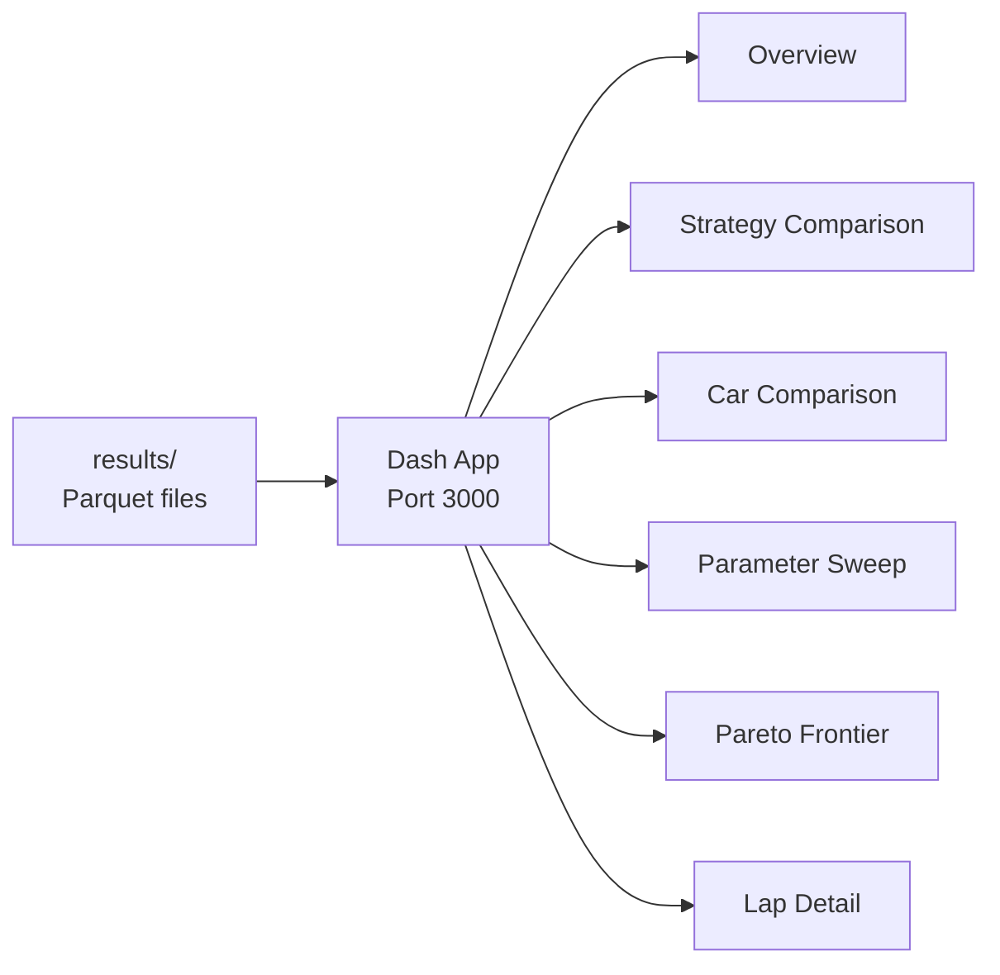

# Dashboard

> [!warning] Status: Stub (Phase 3)
> The Dash app skeleton exists with 6 placeholder pages but no content yet.

**Source:** `dashboard/`

---

## Architecture



The dashboard reads pre-computed simulation results (Parquet files in `results/`). It does NOT run simulations directly.

---

## Planned Pages

| Page | Purpose | Key Visualizations |
|------|---------|-------------------|
| **Overview** | Key metrics summary | Endurance time, energy, SOC, points |
| **Strategy** | Compare driver strategies | Speed traces, energy curves, lap times |
| **Cars** | CT-16EV vs CT-17EV | Side-by-side parameter comparison |
| **Sweep** | Parameter sweep results | Heatmaps, sensitivity plots |
| **Pareto** | Time vs. energy frontier | Scatter plot with Pareto curve |
| **Lap Detail** | Segment-by-segment dive | Speed, torque, current vs. distance |

---

## Running the Dashboard

```bash
# Via Docker
docker-compose up

# Or directly
python -m dashboard
```

Runs on **port 3000** with Dash debug mode enabled.

See also: [[Getting Started]], [[Roadmap]]
