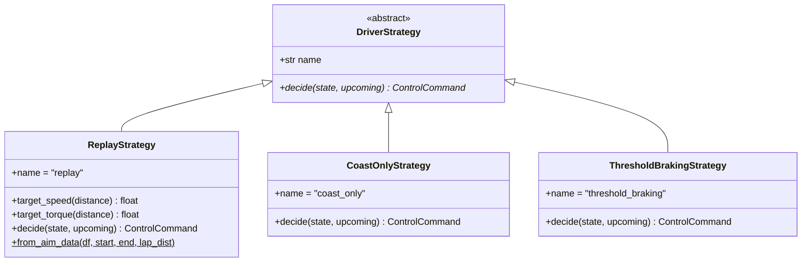
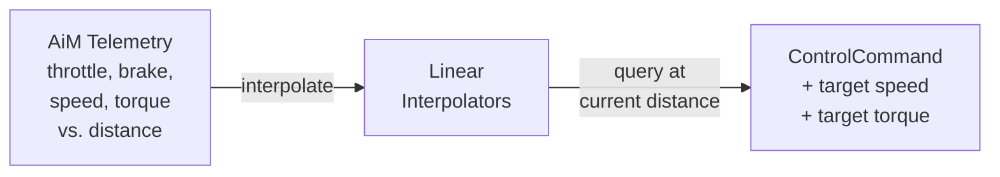
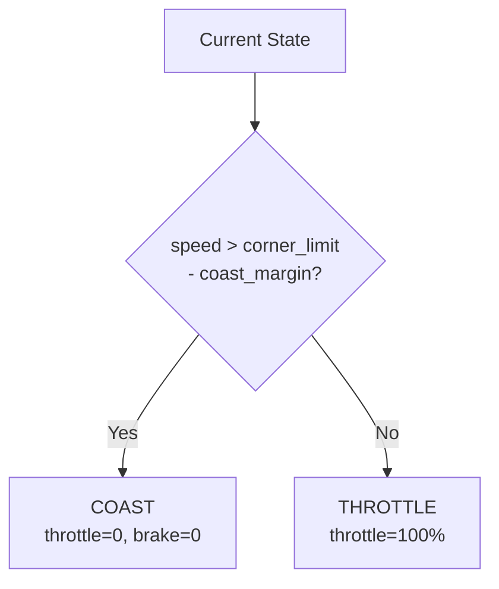
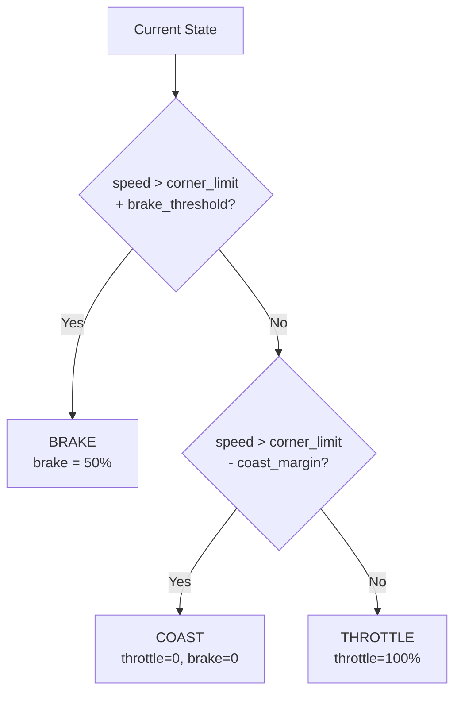
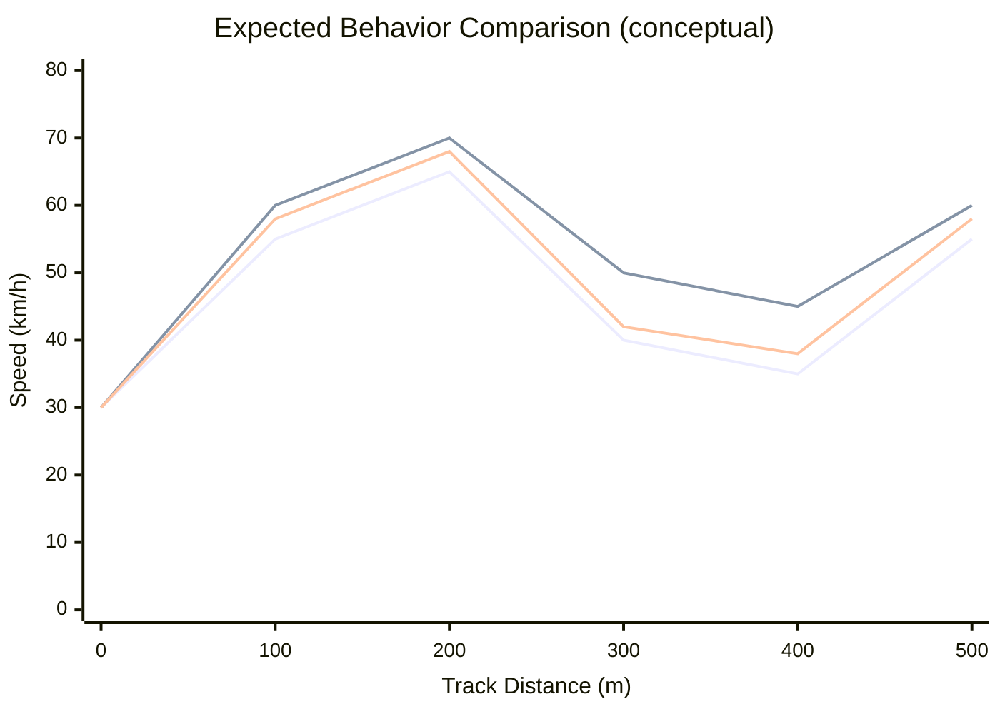

# Driver Strategies

> [!summary]
> Three driver control strategies determine throttle, coast, and brake behavior at each track segment. Strategies range from **replay** (reproduce real telemetry) to **synthetic** (algorithmic decisions).

**Source:** `src/fsae_sim/driver/strategy.py`, `src/fsae_sim/driver/strategies.py`

---

## Strategy Pattern

All strategies implement the same interface:



### Decision Interface

```python
def decide(state: SimState, upcoming: list[Segment]) -> ControlCommand
```

- **Input:** Current simulation state + next 5 segments (lookahead)
- **Output:** One of three actions with intensity:

| Action | throttle_pct | brake_pct | Description |
|--------|-------------|-----------|-------------|
| THROTTLE | 0.0 — 1.0 | 0.0 | Apply motor torque |
| COAST | 0.0 | 0.0 | Zero torque, roll |
| BRAKE | 0.0 | 0.0 — 1.0 | Regen / friction braking |

---

## Strategy 1: ReplayStrategy

> [!info] Most Accurate for Validation
> Reproduces the real driver's behavior from AiM telemetry. This is the primary strategy for **validating** the simulation against recorded data.

### How It Works



- Builds interpolation functions from one recorded lap
- At each segment, queries throttle/brake/speed/torque at the current distance
- Speed comes directly from telemetry (not computed from forces)
- Wraps around `lap_distance_m` for multi-lap simulation

### Data Extraction

From AiM CSV:
- **Throttle:** `Throttle Pos / 100`, clamped to [0, 1]
- **Brake:** `max(FBrakePressure, RBrakePressure)`, normalized to 99th percentile
- **Speed:** `GPS Speed / 3.6` (km/h → m/s)
- **Torque:** `LVCU Torque Req`, capped at 85 Nm (inverter limit)

---

## Strategy 2: CoastOnlyStrategy

> [!note] Matches 2025 Team Approach
> The CT-16EV team used minimal braking — full throttle on straights, coasting into corners. This strategy models that behavior.

### Decision Logic



- **Lookahead:** Finds minimum corner speed limit in next 5 segments
- **Coast margin:** 2.0 m/s default — starts coasting before reaching the limit
- **No braking at all** — relies on aerodynamic drag and rolling resistance to slow down

---

## Strategy 3: ThresholdBrakingStrategy

> [!tip] Most Realistic Synthetic Strategy
> Adds regenerative braking when coasting alone isn't enough to slow down for corners.

### Decision Logic



| Parameter | Default | Description |
|-----------|---------|-------------|
| `coast_margin_ms` | 3.0 m/s | Start coasting this far before corner limit |
| `brake_threshold_ms` | 1.0 m/s | Brake if exceeding corner limit by this much |
| `brake_intensity` | 0.5 | Brake pedal fraction when applied |

---

## Strategy Comparison



| Strategy | Lap Time | Energy Use | Realism |
|----------|----------|------------|---------|
| Replay | Matches real | Matches real | Highest (is real) |
| Coast Only | Slower (over-speeds corners) | Lower (no regen) | Medium (2025 approach) |
| Threshold Braking | Moderate | Moderate (with regen) | Good (typical driver) |

---

## SimState (Driver Input)

The driver sees this snapshot at each decision point:

| Field | Type | Description |
|-------|------|-------------|
| `time` | float | Elapsed seconds |
| `distance` | float | Cumulative meters |
| `speed` | float | Current speed (m/s) |
| `soc` | float | Battery SOC (0-1) |
| `pack_voltage` | float | Terminal voltage (V) |
| `pack_current` | float | Current draw (A) |
| `cell_temp` | float | Cell temperature (°C) |
| `lap` | int | Current lap number |
| `segment_idx` | int | Current segment index |

See also: [[Simulation Engine]], [[Track Module]], [[Telemetry Data]]
