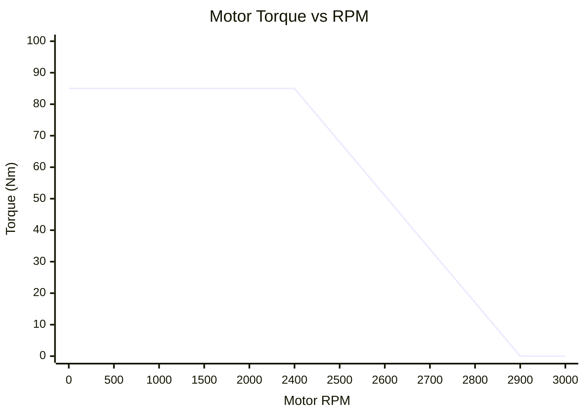
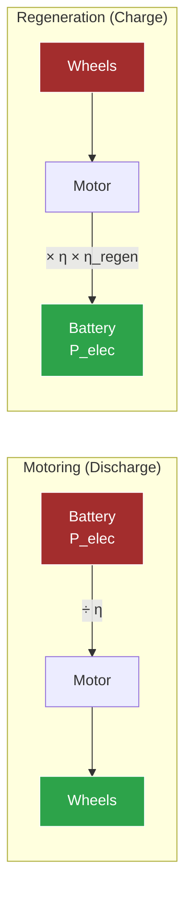

# Powertrain Model

> [!summary]
> Maps motor speed, torque, and power through the single-speed gearbox to wheel force — with separate paths for motoring (driving) and regeneration (braking).

**Source:** `src/fsae_sim/vehicle/powertrain_model.py`

---

## Motor Torque Curve

The motor has two operating regions:

| Region | RPM Range | Torque | Description |
|--------|-----------|--------|-------------|
| **Constant Torque** | 0 — 2400 | 85 Nm | Limited by inverter IQ current (170A) |
| **Field Weakening** | 2400 — 2900 | 85 → 0 Nm | Linear taper as back-EMF increases |
| **Overspeed** | > 2900 | 0 Nm | Cannot operate |

> [!note] Two Torque Limits
> The **inverter limit** (85 Nm) is the binding constraint. The **LVCU limit** (150 Nm) is a mechanical safety backup that never activates under normal conditions.

---

## Drivetrain Path

### Speed Conversion

$$RPM_{motor} = \frac{v}{r_{tire}} \times \frac{60}{2\pi} \times G$$

Where:
- $v$ = vehicle speed (m/s)
- $r_{tire}$ = 0.228 m (10-inch FSAE wheel)
- $G$ = 3.6363 (gear ratio, 40/11 teeth)

**Maximum vehicle speed** at 2900 RPM: **~68 km/h** (~19.0 m/s)

### Force at Wheels

$$F_{drive} = \frac{\tau_{motor} \times G \times \eta}{r_{tire}}$$

**Peak tractive force** at low speed: $\frac{85 \times 3.6363 \times 0.92}{0.228} \approx$ **1,247 N**

---

## Power Flow

### Motoring (Battery → Wheels)

$$P_{electrical} = \frac{\tau_{motor} \times \omega_{motor}}{\eta_{drivetrain}}$$

Power flows from battery through inverter → motor → gearbox → wheels, with 8% losses at the drivetrain.

### Regeneration (Wheels → Battery)

$$P_{electrical} = \tau_{motor} \times \omega_{motor} \times \eta_{drivetrain} \times \eta_{regen}$$

Where $\eta_{regen}$ = 0.85 (additional 15% losses in regen mode due to inverter switching).

**Effective regen efficiency:** 0.92 × 0.85 = **78.2%**

---

## Key Parameters

| Parameter | Value | Unit |
|-----------|-------|------|
| Motor max RPM | 2900 | rpm |
| Constant-torque cutoff | 2400 | rpm |
| Torque limit (inverter) | 85 | Nm |
| Torque limit (LVCU) | 150 | Nm |
| Gear ratio | 3.6363 | — |
| Drivetrain efficiency | 92% | — |
| Regen efficiency factor | 85% | — |
| Tire radius | 0.228 | m |
| Max vehicle speed | ~68 | km/h |
| Peak tractive force | ~1,247 | N |
| Peak electrical power | ~25 | kW |

---

## Key Methods

| Method | Description |
|--------|-------------|
| `motor_rpm_from_speed(v)` | Vehicle speed → motor RPM |
| `speed_from_motor_rpm(rpm)` | Motor RPM → vehicle speed |
| `max_motor_torque(rpm)` | Available torque at RPM |
| `wheel_torque(torque)` | Motor torque → wheel torque |
| `wheel_force(torque)` | Motor torque → force at ground |
| `drive_force(throttle, speed)` | Throttle + speed → tractive force |
| `regen_force(brake, speed)` | Brake + speed → regen force (negative) |
| `electrical_power(torque, rpm)` | Mechanical → electrical power |
| `pack_current(power, voltage)` | Electrical power → battery current |

See also: [[Motor Torque Curve]], [[CT-16EV (2025)]], [[Battery Model]]
