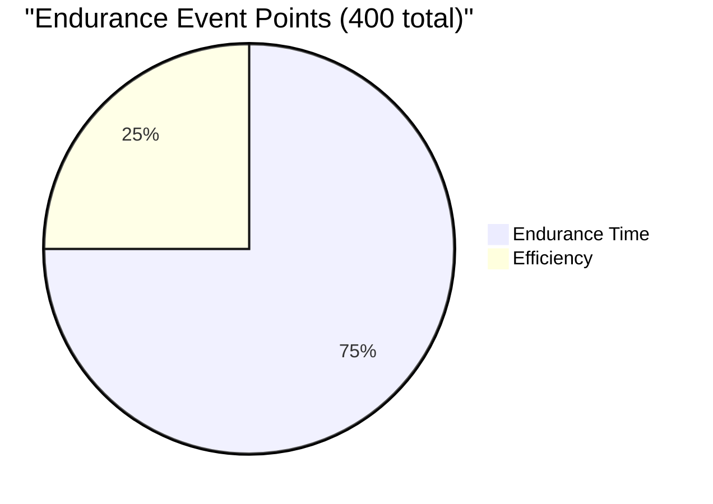

# Scoring Module

> [!warning] Status: Stub (Phase 4)
> The scoring formulas are defined as interfaces but not yet implemented.

**Source:** `src/fsae_sim/scoring/scoring.py`

---

## FSAE Scoring Overview

In FSAE competition, the endurance event awards two types of points:



### Endurance Points (300 max)

Based on corrected elapsed time relative to the fastest team:

$$Points = 300 \times \frac{T_{max} - T_{team}}{T_{max} - T_{fastest}}$$

Where $T_{max}$ is typically 1.45 × $T_{fastest}$.

### Efficiency Points (100 max)

Based on energy consumption relative to the most efficient team, weighted by time:

$$Points = 100 \times \frac{E_{max} - E_{team}}{E_{max} - E_{min}}$$

> [!note] The Tradeoff
> Going faster improves endurance points but usually increases energy consumption (hurting efficiency). The simulation's goal is to find the **optimal balance** — the parameter configuration and strategy that maximizes **total points** (endurance + efficiency).

---

## Planned Interface

```python
@dataclass(frozen=True)
class EnduranceScore:
    endurance_points: float
    efficiency_points: float
    total_points: float

def calculate_endurance_points(
    team_time_s: float,
    fastest_time_s: float,
    max_points: float = 300.0
) -> float: ...

def calculate_efficiency_points(
    team_energy_kwh: float,
    team_time_s: float,
    min_energy_kwh: float,
    fastest_time_s: float,
    max_points: float = 100.0
) -> float: ...
```

See also: [[Roadmap]], [[System Overview]]
