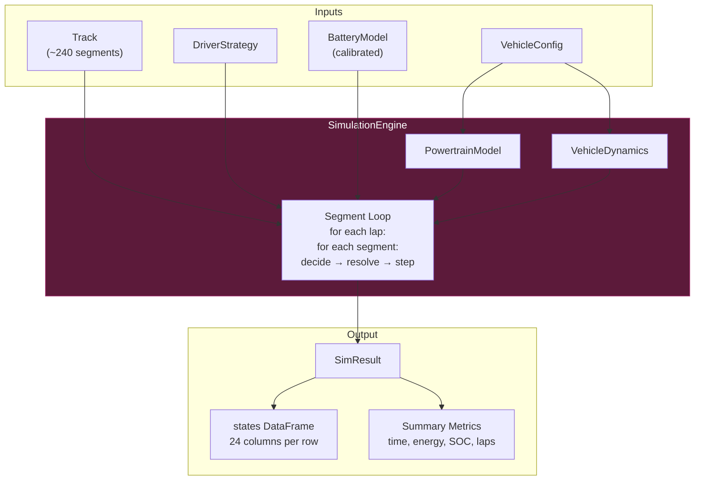
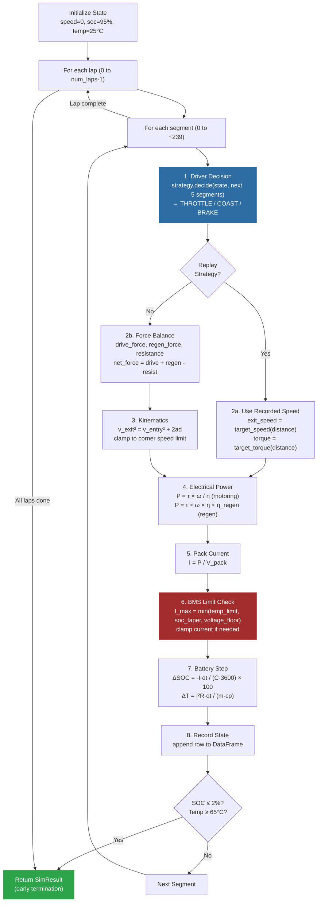
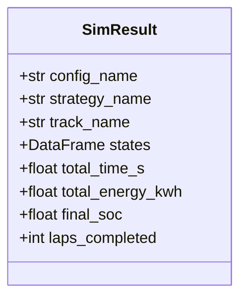

# Simulation Engine

> [!summary]
> The central orchestrator that ties all physics models together — stepping through track segments, computing forces, resolving speeds, tracking battery state, and producing a detailed results DataFrame.

**Source:** `src/fsae_sim/sim/engine.py`

---

## Architecture



---

## The Run Loop (Detailed)

```python
engine.run(num_laps=1, initial_soc_pct=95.0, initial_temp_c=25.0, initial_speed_ms=0.0)
```



---

## SimResult Structure



### States DataFrame (24 columns)

| Group | Columns |
|-------|---------|
| **Position** | lap, segment_idx, time_s, distance_m |
| **Speed** | speed_ms, speed_kmh |
| **Battery** | soc_pct, pack_voltage_v, pack_current_a, cell_temp_c |
| **Powertrain** | motor_rpm, motor_torque_nm, electrical_power_w |
| **Forces** | drive_force_n, regen_force_n, resistance_force_n, net_force_n |
| **Timing** | segment_time_s |
| **Driver** | action, throttle_pct, brake_pct |
| **Track** | curvature, corner_speed_limit_ms, grade |

---

## Two Execution Modes

The engine handles [[Driver Strategies|ReplayStrategy]] differently from synthetic strategies:

| Aspect | Replay Mode | Force-Based Mode |
|--------|-------------|-----------------|
| Speed source | Recorded telemetry | Kinematic equation |
| Torque source | Recorded LVCU request | Computed from throttle × max_torque |
| Corner limits | Not applied (real driver already respected them) | Applied as speed clamp |
| Best for | Validation against real data | What-if analysis |

---

## Energy Accounting

Total energy consumed:

$$E_{total} = \sum_{segments} P_{electrical} \times \Delta t$$

Where:
- Positive $P$ = discharge (motoring) — adds to consumption
- Negative $P$ = charge (regen) — subtracts from consumption

Converted to kWh: $E_{kwh} = E_{total} / 3,600,000$

---

## Usage

```python
from fsae_sim.vehicle import VehicleConfig
from fsae_sim.vehicle.battery_model import BatteryModel
from fsae_sim.track import Track
from fsae_sim.driver.strategies import CoastOnlyStrategy
from fsae_sim.sim import SimulationEngine

# Setup
config = VehicleConfig.from_yaml("configs/ct16ev.yaml")
track = Track.from_telemetry("Real-Car-Data-And-Stats/2025 Endurance Data.csv")
battery = BatteryModel.from_config_and_data(config.battery, voltt_cell_csv)
strategy = CoastOnlyStrategy(dynamics)

# Run
engine = SimulationEngine(config, track, strategy, battery)
result = engine.run(num_laps=22, initial_soc_pct=95.0)

# Results
print(f"Total time: {result.total_time_s:.1f} s")
print(f"Energy used: {result.total_energy_kwh:.2f} kWh")
print(f"Final SOC: {result.final_soc:.1f}%")
print(f"Laps completed: {result.laps_completed}")
```

See also: [[System Overview]], [[Data Flow]], [[Driver Strategies]]
