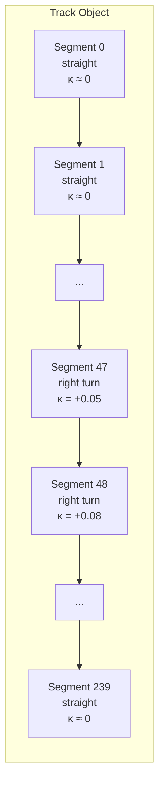
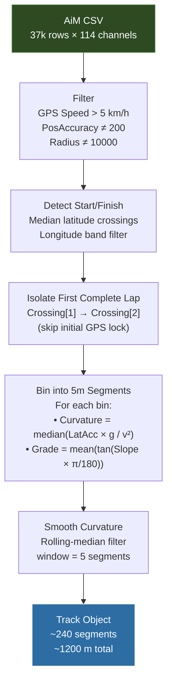

# Track Module

> [!summary]
> Represents track geometry as an ordered sequence of 5-meter segments with curvature, grade, and grip properties — extracted from real GPS telemetry.

**Source:** `src/fsae_sim/track/track.py`

---

## Track Representation



Each segment is a frozen dataclass:

| Property | Type | Description |
|----------|------|-------------|
| `index` | int | Sequence number (0-based) |
| `distance_start_m` | float | Cumulative distance to segment start |
| `length_m` | float | Segment length (typically 5 m) |
| `curvature` | float | Signed curvature (1/m); + = right, - = left |
| `grade` | float | Rise/run (dimensionless); + = uphill |
| `grip_factor` | float | Multiplier on base grip (default 1.0) |

---

## Track Extraction Algorithm

The `Track.from_telemetry()` method converts raw GPS data into simulation segments:



### Step Details

**1. GPS Filtering**
- Remove stationary data (speed < 5 km/h) — car in pits or staging
- Remove cold-start GPS samples (PosAccuracy = 200 mm) — inaccurate
- Remove uncertain curvature (Radius = 10000 m) — AiM straight detection

**2. Start/Finish Detection**
- Median latitude serves as the S/F line
- Upward crossings detected (latitude increasing through median)
- Longitude band filter (±0.001°, ~90 m) removes non-S/F crossings
- Requires ≥ 2 crossings to define one complete lap

**3. Lap Isolation**
- Uses crossing[1] → crossing[2], not crossing[0]
- Crossing[0] may have poor GPS fix (just acquired signal)

**4. Curvature Calculation**
For each 5m bin:
$$\kappa = \text{median}\left(\frac{a_{lat} \times g}{v^2}\right)$$

- $a_{lat}$ from GPS lateral acceleration (in g)
- $v$ from GPS speed (converted to m/s)
- Low-speed samples (< 2 m/s) masked to reduce noise

**5. Smoothing**
- Rolling-median filter with window=5 (25m) removes GPS noise spikes

---

## Michigan 2025 Track Statistics

| Property | Value |
|----------|-------|
| Total lap distance | ~1,200 m |
| Number of segments | ~240 |
| Segment length | 5 m |
| Curvature range | -0.1 to +0.1 (1/m) |
| Corresponding radii | 10 m to ∞ |
| Typical grades | ±2% |

> [!info] FSAE Endurance Format
> An FSAE endurance event is typically 22 km total — about **18-22 laps** of a ~1 km track. The simulation runs the same track geometry for all laps.

---

## Usage

```python
from fsae_sim.track import Track

# Extract from AiM telemetry
track = Track.from_telemetry(
    aim_csv_path="Real-Car-Data-And-Stats/2025 Endurance Data.csv",
    bin_size_m=5.0,
    name="Michigan Endurance 2025"
)

print(track.total_distance_m)  # ~1200
print(track.num_segments)      # ~240

# Access individual segments
seg = track.segments[47]
print(seg.curvature)    # e.g., 0.05 (right turn, R=20m)
print(seg.grade)        # e.g., 0.01 (1% uphill)
```

See also: [[Telemetry Data]], [[Vehicle Dynamics]], [[Quasi-Static Simulation]]
