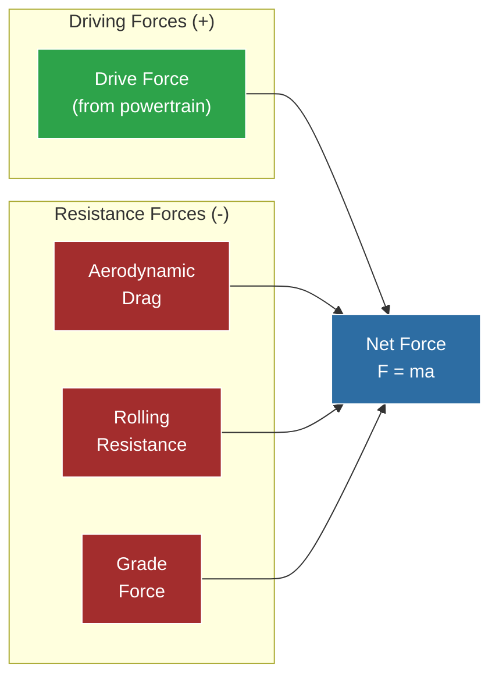

# Vehicle Dynamics

> [!summary]
> A point-mass force-balance model computing aerodynamic drag, rolling resistance, grade forces, and maximum cornering speeds.

**Source:** `src/fsae_sim/vehicle/dynamics.py`

---

## Force Model

All forces acting on the vehicle along the direction of travel:

---

## Aerodynamic Drag

$$F_{drag} = \frac{1}{2} \rho \cdot C_dA \cdot v^2$$

| Variable | Value | Unit |
|----------|-------|------|
| $\rho$ (air density) | 1.225 | kg/m³ |
| $C_dA$ (drag coeff × area) | 1.50 | m² |

**Drag grows with the square of speed:**

| Speed | Drag Force |
|-------|-----------|
| 20 km/h | ~5 N |
| 40 km/h | ~23 N |
| 60 km/h | ~51 N |
| 71 km/h (max) | ~72 N |

> [!info] Context
> At FSAE speeds (typically 30-60 km/h), aerodynamic drag is comparable to rolling resistance. Neither dominates — both matter for energy consumption.

---

## Rolling Resistance

$$F_{rr} = m \cdot g \cdot C_{rr}$$

$$F_{rr} = 288 \times 9.81 \times 0.015 \approx 42 \text{ N}$$

Rolling resistance is **constant** (speed-independent at FSAE speeds). At ~42 N, it's always present regardless of speed.

---

## Grade Force

$$F_{grade} = m \cdot g \cdot \sin(\arctan(grade))$$

For small grades (typical at Michigan, ±2%):

$$F_{grade} \approx m \cdot g \cdot grade = 288 \times 9.81 \times 0.02 \approx 57 \text{ N}$$

- Positive grade = uphill = additional resistance
- Negative grade = downhill = assists motion

---

## Maximum Cornering Speed

$$v_{max} = \sqrt{\frac{a_{lat,max}}{|\kappa|}}$$

Where:
- $a_{lat,max} = 1.3g \times g_{gravity} = 12.75$ m/s²
- $\kappa$ = curvature (1/radius, in 1/m)

| Radius | Curvature | Max Speed |
|--------|-----------|-----------|
| ∞ (straight) | 0 | ∞ |
| 50 m | 0.02 | 90 km/h |
| 25 m | 0.04 | 64 km/h |
| 15 m | 0.067 | 50 km/h |
| 10 m | 0.10 | 41 km/h |
| 5 m | 0.20 | 29 km/h |

> [!note] 1.3g Lateral Grip
> This is typical for FSAE cars on Hoosier R25B/LC0 tires on dry asphalt. The `grip_factor` parameter on each track segment can modify this for varying surface conditions.

---

## Speed Resolution

Given entry speed, segment length, and net force, the exit speed is:

$$v_{exit}^2 = v_{entry}^2 + 2 \cdot a \cdot d$$

Where $a = F_{net} / m$ and $d$ = segment length (5 m).

The exit speed is then **clamped** to the segment's corner speed limit:

$$v_{exit} = \min(v_{kinematic}, v_{corner})$$

Segment time is computed from average speed:

$$t = \frac{d}{\bar{v}} = \frac{2d}{v_{entry} + v_{exit}}$$

---

## Constants

| Constant | Value | Unit |
|----------|-------|------|
| Air density | 1.225 | kg/m³ |
| Gravity | 9.81 | m/s² |
| Max lateral acceleration | 1.3 | g |
| Minimum simulation speed | 0.5 | m/s |

See also: [[Aerodynamic Forces]], [[Quasi-Static Simulation]], [[Track Module]]
