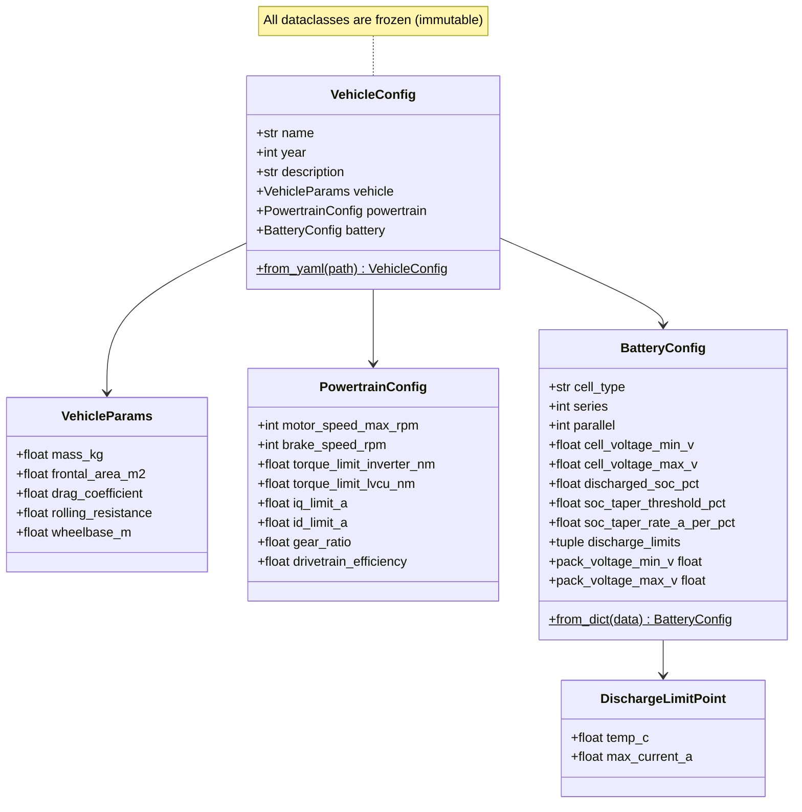

# Vehicle Module

> [!summary]
> Defines the vehicle configuration structure and loads parameters from YAML files. This is the **entry point** for all vehicle-related data — every other model receives its parameters through this module.

**Source:** `src/fsae_sim/vehicle/vehicle.py`

---

## Class Diagram



---

## Config Files

Two YAML configs ship with the repo:

| Config | Car | File |
|--------|-----|------|
| [[CT-16EV (2025)]] | 2025 competition car | `configs/ct16ev.yaml` |
| [[CT-17EV (2026)]] | 2026 design target | `configs/ct17ev.yaml` |

### Loading a Config

```python
from fsae_sim.vehicle import VehicleConfig

config = VehicleConfig.from_yaml("configs/ct16ev.yaml")
print(config.vehicle.mass_kg)       # 288.0
print(config.battery.series)        # 110
print(config.powertrain.gear_ratio) # 3.6363
```

---

## Vehicle Parameters

### Physical Properties (VehicleParams)

| Parameter | CT-16EV | CT-17EV | Unit | Notes |
|-----------|---------|---------|------|-------|
| Mass (with driver) | 288 | 279 | kg | 68 kg driver included |
| Frontal area | 1.0 | 1.0 | m² | DSS reference area |
| CdA (drag coeff × area) | 1.502 | 1.502 | m² | Back-derived from DSS (431 N at 80 kph) |
| Rolling resistance | 0.015 | 0.015 | — | Hoosier R25B/LC0 |
| Wheelbase | 1.53 | 1.53 | m | — |

> [!warning] Assumptions
> Several parameters are estimates that need refinement:
> - **Mass** includes a standard 68 kg driver — actual driver mass varies
> - **CdA = 1.502 m²** is back-derived from DSS drag force (431 N at 80 kph)
> - **Crr = 0.015** is typical for FSAE tires but not measured on this car
> - **Frontal area = 1.0 m²** is the DSS reference area

---

## Exports

From `vehicle/__init__.py`:
- `VehicleConfig` — Top-level config container
- `VehicleParams` — Physical vehicle properties
- `PowertrainConfig` — Motor/inverter/gearbox config
- `PowertrainModel` — Runtime powertrain calculations
- `BatteryConfig` — Pack configuration
- `DischargeLimitPoint` — Temperature-dependent current limit

See also: [[Battery Model]], [[Powertrain Model]], [[Vehicle Dynamics]]
