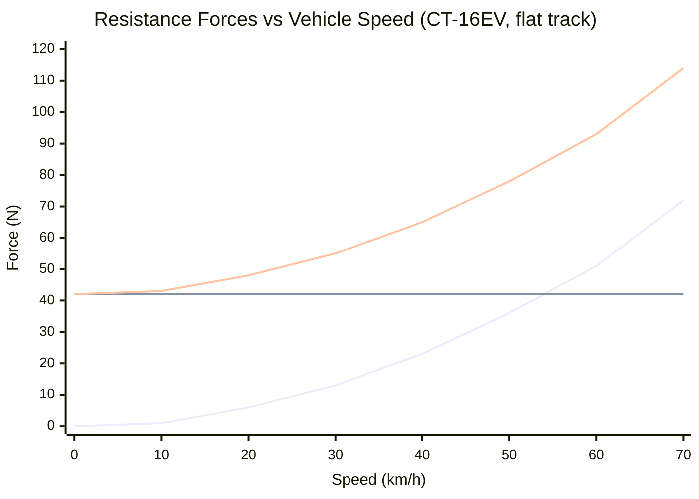

# Aerodynamic & Resistance Forces

> [!summary]
> The three resistance forces that the powertrain must overcome: aerodynamic drag, rolling resistance, and grade force. Understanding their relative magnitudes at FSAE speeds is key to energy optimization.

---

## Force Breakdown

---

## Aerodynamic Drag

$$F_{drag} = \frac{1}{2} \rho \cdot C_dA \cdot v^2$$

| Parameter | Value | Unit |
|-----------|-------|------|
| Air density ($\rho$) | 1.225 | kg/m³ |
| $C_dA$ (drag coefficient × area) | 1.50 | m² |

The $C_dA$ of 1.50 m² is back-derived from the DSS: 431 N drag at 80 kph. The DSS reports integer-rounded $C_d$ and $A$ values individually, so only the combined $C_dA$ product is reliable.

### Drag Power

$$P_{drag} = F_{drag} \times v = \frac{1}{2}\rho \cdot C_dA \cdot v^3$$

Power grows with the **cube** of speed — going twice as fast takes **8x** the power to overcome drag.

| Speed | Drag Force | Drag Power |
|-------|-----------|------------|
| 30 km/h | 13 N | 108 W |
| 50 km/h | 36 N | 500 W |
| 60 km/h | 51 N | 850 W |
| 71 km/h (max) | 72 N | 1,400 W |

---

## Rolling Resistance

$$F_{rr} = m \cdot g \cdot C_{rr} = 288 \times 9.81 \times 0.015 \approx 42 \text{ N}$$

Rolling resistance is **constant** (speed-independent at FSAE speeds).

| Parameter | Value |
|-----------|-------|
| Vehicle mass | 288 kg |
| Coefficient ($C_{rr}$) | 0.015 |
| Force | ~42 N |

> [!info] Rolling Resistance Dominance at Low Speed
> Below ~45 km/h, rolling resistance exceeds aerodynamic drag. Since FSAE corners are typically at 30-50 km/h, rolling resistance is the dominant loss for a significant fraction of the lap.

### Rolling Resistance Power

$$P_{rr} = F_{rr} \times v = 42v$$

| Speed | RR Power |
|-------|----------|
| 30 km/h | 350 W |
| 50 km/h | 583 W |
| 71 km/h | 828 W |

---

## Grade Force

$$F_{grade} = m \cdot g \cdot \sin(\arctan(grade))$$

For small grades (typical at Michigan, ±2%):

$$F_{grade} \approx m \cdot g \cdot grade$$

| Grade | Force | Effect |
|-------|-------|--------|
| +2% (uphill) | +53 N | Additional resistance |
| 0% (flat) | 0 N | — |
| -2% (downhill) | -53 N | Assists motion |

> [!note] Michigan is Mostly Flat
> The Michigan FSAE site has very mild grades (±2% typical). Grade forces are comparable to rolling resistance but average out over a full lap.

---

## Total Resistance Budget

At 50 km/h on flat ground (typical FSAE corner exit speed):

| Force | Value | Fraction |
|-------|-------|----------|
| Aerodynamic drag | 36 N | 46% |
| Rolling resistance | 42 N | 54% |
| Grade (flat) | 0 N | 0% |
| **Total** | **78 N** | 100% |

**Power to maintain 50 km/h:** 78 × 13.9 = **1,084 W** (about 1 kW)

Compare to peak drive force of **1,247 N** — the car has ~16× more force available than needed to maintain speed. This means:
- Acceleration is not power-limited at FSAE speeds
- Energy consumption is dominated by **how much you brake and re-accelerate**, not by steady-state losses
- **Strategy matters more than raw power** for endurance efficiency

See also: [[Vehicle Dynamics]], [[Quasi-Static Simulation]], [[Driver Strategies]]
