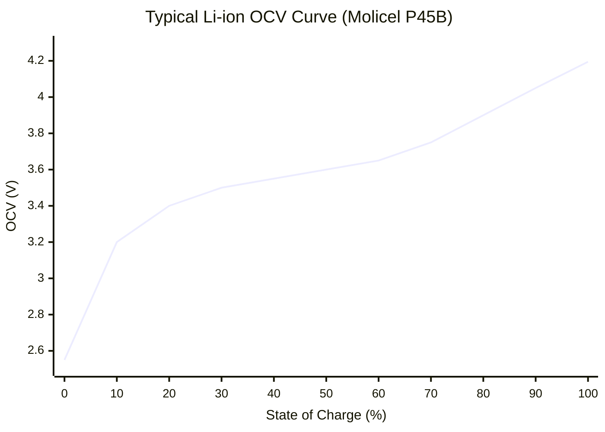

# Battery Physics

> [!summary]
> The electrochemical and thermal principles behind the [[Battery Model]] — how lithium-ion cells behave under load and how we model that behavior.

---

## Equivalent Circuit Model

The simplest useful battery model: a voltage source (OCV) in series with a resistor (R_int):

```
    ┌──────┐     ┌──────┐
────┤ OCV  ├─────┤ R_int├────── V_terminal
    │(SOC) │     │(SOC) │
    └──────┘     └──────┘
         ↑              ↑
    Open-circuit    Internal
    voltage         resistance
```

$$V_{terminal} = V_{OCV}(SOC) - I \cdot R_{int}(SOC)$$

- **$V_{OCV}$** depends only on SOC (state of charge)
- **$R_{int}$** depends on SOC (and weakly on temperature — not yet modeled)
- **$I$** is positive for discharge, negative for charge (regen)

> [!info] Why This Model?
> More complex models (2RC, Thevenin, electrochemical) capture transient voltage response. But for a quasi-static simulation stepping through 5m segments (0.3-0.6s each), the steady-state response dominates. The simple model matches Voltt data within 2%.

---

## Open-Circuit Voltage (OCV)

The OCV is the terminal voltage when no current flows — it represents the thermodynamic equilibrium potential of the cell.



**Key characteristics:**
- **Monotonically increasing** with SOC
- **Steep at extremes** (0-10% and 90-100%)
- **Flat in the middle** (30-70%) — this is where most operation happens
- **Calibrated** by extracting the `OCV [V]` column from Voltt simulation data

---

## Internal Resistance

The internal resistance causes voltage drop under load and generates heat:

$$V_{drop} = I \cdot R_{int}$$

$$P_{heat} = I^2 \cdot R_{int}$$

| SOC Region | Typical R_int | Notes |
|------------|--------------|-------|
| Low (0-20%) | 50-100 mΩ | Highest — depleted electrolyte |
| Mid (20-80%) | 15-30 mΩ | Lowest — optimal operation |
| High (80-100%) | 20-40 mΩ | Slightly elevated |

**Extraction method:** From Voltt data, during discharge samples:
$$R_{int} = \frac{V_{OCV} - V_{terminal}}{|I|}$$

Binned into 2% SOC windows with median aggregation for robustness.

---

## Coulomb Counting (SOC Tracking)

SOC changes proportionally to current and time:

$$\Delta SOC = -\frac{I \cdot \Delta t}{C_{cell} \cdot 3600} \times 100\%$$

| Variable | Description | Value |
|----------|-------------|-------|
| $I$ | Pack current (A) | Positive = discharge |
| $\Delta t$ | Time step (s) | Segment time |
| $C_{cell}$ | Cell capacity (Ah) | 4.5 (P45B) or 5.0 (P50B) |
| 3600 | s/hr conversion | — |

**Discharged at SOC = 2%** (not 0% — BMS safety margin).

---

## Thermal Model

A lumped thermal model — each cell is a uniform-temperature mass:

$$\Delta T = \frac{P_{heat} \cdot \Delta t}{m_{cell} \cdot c_p}$$

| Parameter | Value | Unit |
|-----------|-------|------|
| Cell mass | 70 | g |
| Specific heat | 1,000 | J/kg/K |
| Thermal capacity | 70 | J/K per cell |
| Pack thermal capacity | ~30,800 | J/K (440 cells) |

### Heat Sources

| Source | Formula | Dominance |
|--------|---------|-----------|
| **Resistive** (I²R) | $I^2 \cdot R_{int}$ | Primary at high current |
| Reversible (entropic) | ~small | Secondary |
| Hysteresis | ~small | Tertiary |

> [!note] Simplified Model
> The simulation only models I²R heating. The Voltt data shows reversible and hysteresis heat are small contributors. Active cooling (CT-17EV) is not yet integrated.

### Temperature Rise Example

At 80A discharge, R_int = 25 mΩ:
$$P_{heat} = 80^2 \times 0.025 = 160 \text{ W per cell}$$
$$\Delta T = \frac{160 \times 1}{0.070 \times 1000} = 2.3 \text{ °C/s per cell}$$

At this rate, starting from 25°C, the cell reaches 65°C (shutdown) in **~17 seconds**. This is why the BMS taper limits are critical — they prevent sustained max-current operation.

---

## Pack Scaling

Cell-level quantities scale to pack level:

| Quantity | Cell → Pack | 110S4P Example |
|----------|------------|----------------|
| Voltage | × series | × 110 |
| Current | × parallel | × 4 |
| Power | × total cells | × 440 |
| Energy | × total cells | × 440 |
| Resistance | × series / parallel | × 27.5 |
| Thermal mass | × total cells | × 440 |

See also: [[Battery Model]], [[BMS Configuration]], [[Battery Simulation Data]]
