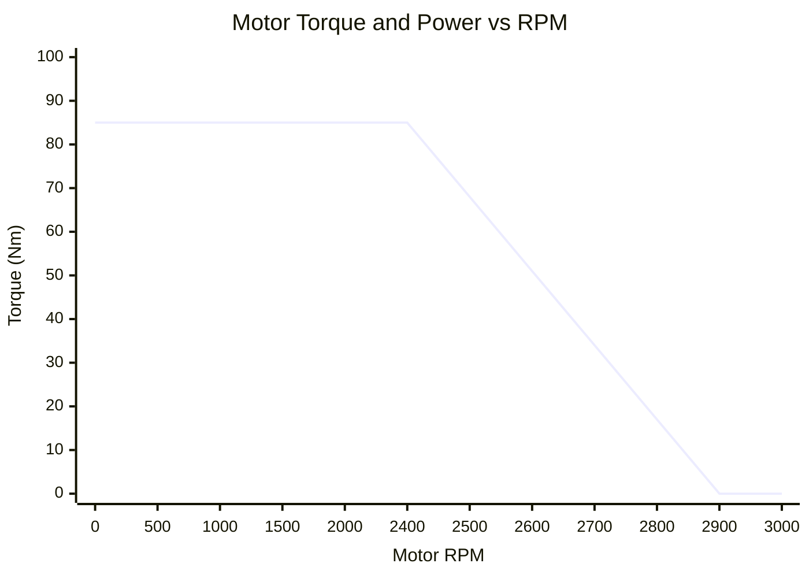

# Motor Torque Curve

> [!summary]
> The CT-16EV uses a Permanent Magnet Synchronous Motor (PMSM) with two operating regions — constant torque and field weakening — driven through a single-speed gearbox.

---

## Torque vs. RPM

### Region 1: Constant Torque (0 — 2,400 RPM)

$$\tau = \min(\tau_{inverter}, \tau_{LVCU}) = \min(85, 150) = 85 \text{ Nm}$$

- Limited by inverter current (IQ = 170A)
- Full torque available from standstill
- **This is where most FSAE driving happens** — corners and acceleration zones

### Region 2: Field Weakening (2,400 — 2,900 RPM)

$$\tau(RPM) = 85 \times \frac{2900 - RPM}{2900 - 2400} = 85 \times \frac{2900 - RPM}{500}$$

- Back-EMF exceeds bus voltage → inject ID current (30A) to weaken field
- Torque tapers linearly from 85 Nm to 0 Nm
- Power remains approximately constant in this region

### Region 3: Overspeed (> 2,900 RPM)

- Motor cannot operate — no torque available
- Vehicle must be at or below max speed (~68 km/h)

---

## Power vs. RPM

$$P = \tau \times \omega = \tau \times \frac{2\pi \times RPM}{60}$$

| RPM | Torque (Nm) | Power (kW) |
|-----|------------|------------|
| 500 | 85 | 4.5 |
| 1000 | 85 | 8.9 |
| 1500 | 85 | 13.4 |
| 2000 | 85 | 17.8 |
| 2400 | 85 | **21.4** (peak constant-torque) |
| 2600 | 51 | 13.9 |
| 2900 | 0 | 0 |

> [!note] Peak Power
> Maximum mechanical power is ~21.4 kW at 2,400 RPM (the boundary between constant-torque and field-weakening). Electrical power is higher due to losses: $P_{elec} = P_{mech} / \eta = 21.4 / 0.92 \approx$ **23.3 kW**.

---

## Speed Mapping

The single-speed gearbox with ratio 3.6363:1 (40/11 teeth) maps motor RPM to vehicle speed:

$$v = \frac{RPM \times 2\pi \times r_{tire}}{60 \times G} = \frac{RPM \times 2\pi \times 0.228}{60 \times 3.6363}$$

| Motor RPM | Vehicle Speed |
|-----------|--------------|
| 0 | 0 km/h |
| 500 | 11.8 km/h |
| 1000 | 23.6 km/h |
| 1500 | 35.4 km/h |
| 2000 | 47.2 km/h |
| 2400 | 56.6 km/h |
| 2900 | **68.4 km/h** (max) |

---

## Force at Wheels

$$F = \frac{\tau \times G \times \eta}{r_{tire}} = \frac{\tau \times 3.6363 \times 0.92}{0.228}$$

| Speed | Motor RPM | Torque | Wheel Force | Acceleration (288 kg) |
|-------|-----------|--------|-------------|----------------------|
| 0 km/h | 0 | 85 Nm | 1,247 N | 4.3 m/s² |
| 30 km/h | ~1,270 | 85 Nm | 1,247 N | 4.3 m/s² |
| 50 km/h | ~2,120 | 85 Nm | 1,247 N | 4.3 m/s² |
| 57 km/h | ~2,400 | 85 Nm | 1,247 N | 4.3 m/s² |
| 63 km/h | ~2,650 | ~43 Nm | 631 N | 2.2 m/s² |
| 68 km/h | ~2,860 | ~7 Nm | 103 N | 0.4 m/s² |

> [!tip] FSAE Context
> Most corners on FSAE tracks have speeds of 30-50 km/h, which puts the car squarely in the constant-torque region. The field-weakening region is only reached on the longest straights.

---

## Regenerative Braking

During regen, the motor acts as a generator:

$$F_{regen} = -\frac{\tau \times G \times \eta \times \eta_{regen}}{r_{tire}}$$

Where $\eta_{regen}$ = 0.85 (additional 15% losses vs. motoring).

**Effective regen efficiency:** 0.92 × 0.85 = **78.2%**

This means for every 1 kWh of kinetic energy captured by regen, only 0.782 kWh returns to the battery.

See also: [[Powertrain Model]], [[Vehicle Dynamics]], [[BMS Configuration]]
