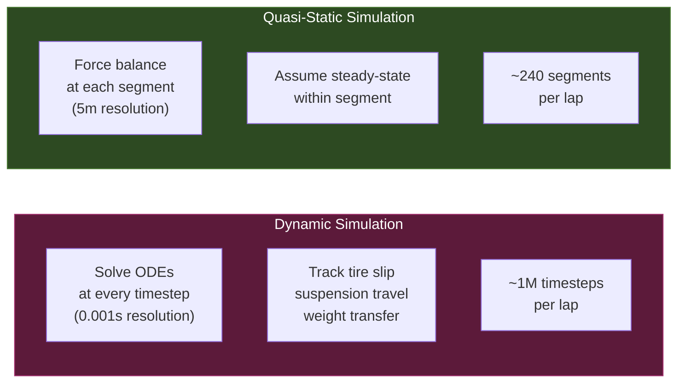
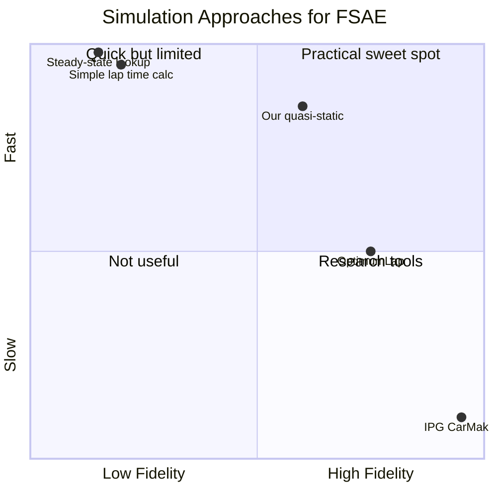

# Quasi-Static Simulation

> [!summary]
> The mathematical methodology behind the simulation — how we model a dynamic system (a race car) using a sequence of steady-state calculations at each track segment.

---

## What is Quasi-Static?

In a **dynamic simulation**, you solve differential equations of motion in continuous time — tracking every oscillation, slip angle, and transient response. This is accurate but computationally expensive.

In a **quasi-static simulation**, you break the track into small segments and assume **steady-state conditions within each segment**. The vehicle is in force equilibrium at each point — you solve an algebraic force balance, not an ODE.

---

## The Algorithm

At each 5-meter segment, the simulation solves:

### Step 1: Force Balance

$$F_{net} = F_{drive} - F_{drag} - F_{rr} - F_{grade} + F_{regen}$$

| Force | Formula | Typical Value |
|-------|---------|---------------|
| Drive | $\tau_{motor} \times G \times \eta / r_{tire}$ | 0 — 1,200 N |
| Drag | $\frac{1}{2}\rho C_d A v^2$ | 5 — 72 N |
| Rolling | $m g C_{rr}$ | ~40 N (constant) |
| Grade | $m g \sin(\arctan(grade))$ | ±53 N at 2% |
| Regen | Negative force (braking) | 0 to -800 N |

### Step 2: Kinematic Speed Update

$$v_{exit}^2 = v_{entry}^2 + 2 \cdot \frac{F_{net}}{m} \cdot \Delta s$$

Where $\Delta s$ = 5 m (segment length).

Then clamp to corner speed limit:

$$v_{exit} = \min\left(v_{kinematic},\ \sqrt{\frac{a_{lat,max}}{|\kappa|}}\right)$$

### Step 3: Time Calculation

$$\Delta t = \frac{2 \Delta s}{v_{entry} + v_{exit}}$$

Using the average speed through the segment (trapezoidal approximation).

### Step 4: Energy and Battery

$$P_{elec} = \frac{\tau \cdot \omega}{\eta} \quad \text{(motoring)}, \qquad P_{elec} = \tau \cdot \omega \cdot \eta \cdot \eta_{regen} \quad \text{(regen)}$$

$$\Delta SOC = -\frac{I \cdot \Delta t}{C \cdot 3600} \times 100\%$$

$$\Delta T = \frac{I^2 R \cdot \Delta t}{m_{cell} \cdot c_p}$$

---

## What We Gain

| Benefit | Why It Matters |
|---------|---------------|
| **Speed** | ~240 segments/lap vs ~1M timesteps | Enables parameter sweeps |
| **Simplicity** | Algebraic equations, no ODE solver | Easier to debug and validate |
| **Transparency** | Every segment's state is independently inspectable | Good for understanding |
| **Adequate accuracy** | 5% target vs. real telemetry | Sufficient for design decisions |

## What We Lose

| Limitation | Impact | Mitigation |
|------------|--------|------------|
| No tire slip model | Can't predict understeer/oversteer | 1.3g lateral limit from data |
| No weight transfer | Corner speed limit is approximate | Empirical grip factor |
| No transient dynamics | Miss acceleration spikes | Forward Euler is adequate at 5m |
| No suspension model | No ride height effects | Not critical for endurance sim |

---

## Why 5-Meter Segments?

| Segment Size | Segments/Lap | Resolution | Trade-off |
|-------------|-------------|------------|-----------|
| 1 m | ~1,200 | Very high | Slow, diminishing returns |
| **5 m** | **~240** | **Good** | **Best balance** |
| 10 m | ~120 | Moderate | Misses tight corners |
| 25 m | ~48 | Low | Too coarse for FSAE |

At FSAE speeds (~30-60 km/h), a 5m segment takes 0.3-0.6 seconds to traverse. This is long enough for steady-state to be a reasonable approximation but short enough to capture the track geometry.

---

## Comparison to Other Approaches

See also: [[System Overview]], [[Vehicle Dynamics]], [[Simulation Engine]]
