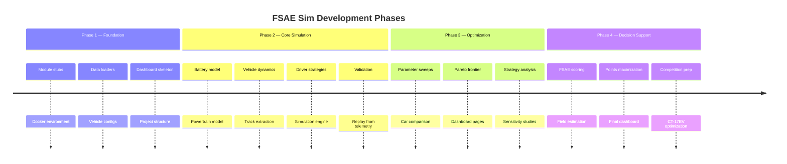

# Roadmap

The project evolves through four phases, each building on the previous.

---

## Phase Overview

---

## Phase 1: Foundation (Complete)

> [!success] Status: Complete

| Deliverable | Description |
|-------------|-------------|
| Module stubs | All package directories with `__init__.py` and interface definitions |
| Docker environment | Dockerfile + docker-compose with live code reload |
| Data loaders | `load_aim_csv()` and `load_voltt_csv()` parsers |
| Vehicle configs | `ct16ev.yaml` and `ct17ev.yaml` |
| Dashboard skeleton | Dash app with 6 placeholder pages on port 3000 |
| Project structure | pyproject.toml, pytest, .gitignore |

---

## Phase 2: Core Simulation (Nearly Done)

> [!abstract] Status: Nearly complete — driver model built (CalibratedStrategy, zone-based), needs finalization and full quality/accuracy validation checks on sim and driver models. Tier 3 upgrade (4-wheel Pacejka tire model) merged and validated (~2% energy error, 8/8 metrics pass).

| Component | Status | Description |
|-----------|--------|-------------|
| [[Battery Model]] | Complete | Equivalent-circuit model calibrated from Voltt data |
| [[Powertrain Model]] | Complete | Motor torque curve, gearbox, efficiency |
| [[Vehicle Dynamics]] | Complete | Drag, rolling resistance, grade, cornering, 4-wheel Pacejka tire model |
| [[Track Module]] | Complete | GPS-based track extraction with smoothing |
| [[Driver Strategies]] | Complete | Replay, coast-only, threshold braking, CalibratedStrategy (zone-based) |
| [[Simulation Engine]] | Complete | Full segment-by-segment loop with tire model integration |
| [[Analysis Module\|Validation]] | Partial | ValidationReport class done, sim validated (~2% energy error, 8/8 metrics pass), driver model validation TBD |
| Test suite | Complete | ~250 tests across all modules |

### Remaining Phase 2 Work
- [x] Build calibrated driver model (CalibratedStrategy, zone-based)
- [x] Integrate 4-wheel Pacejka tire model (Tier 3 upgrade)
- [x] Validate simulation against real telemetry (~2% energy error, 8/8 metrics pass)
- [ ] Finalize driver model quality/accuracy validation checks
- [ ] Document validated baseline results

---

## Phase 3: Optimization & Comparison (Next)

> [!todo] Status: Next — begins after Phase 2 finalization

| Deliverable | Description |
|-------------|-------------|
| Parameter sweep runner | Vary one parameter, run N simulations, collect results |
| Car comparison | CT-16EV vs CT-17EV predicted performance |
| Strategy analysis | Compare coast-only vs. threshold braking vs. custom |
| Pareto frontier | Time vs. energy tradeoff visualization |
| Dashboard pages | Populate the 6 stub pages with real visualizations |

### Key Questions to Answer
- What gear ratio maximizes points for CT-17EV?
- How much does 9 kg mass reduction affect lap time?
- What's the optimal regen braking intensity?
- How does active cooling change the strategy space?
- What SOC should we target at end of endurance?

---

## Phase 4: Decision Support (Future)

> [!todo] Status: Future

| Deliverable | Description |
|-------------|-------------|
| FSAE scoring formulas | Implement endurance + efficiency point calculations |
| Field estimation | Estimate competitor performance for relative scoring |
| Points maximization | Find the parameter + strategy combo that maximizes total points |
| Decision dashboard | Final visualization for team decision-making |

### Ultimate Goal
> Given the CT-17EV hardware constraints, what combination of gear ratio, torque limits, regen strategy, and driver behavior maximizes our **total competition points** (endurance + efficiency)?

---

## Competition Timeline

| Date | Milestone |
|------|-----------|
| April 2026 | Simulation validation complete |
| May 2026 | Parameter optimization complete |
| ~June 2026 | FSAE 2026 competition |

See also: [[System Overview]], [[Home]]
