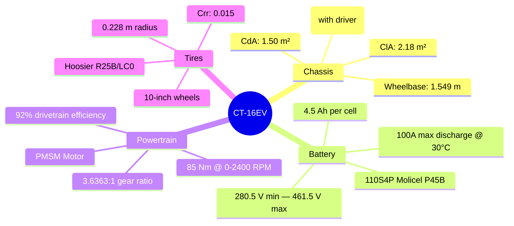

# CT-16EV (2025)

> [!info] The Real Car
> The 2025 UConn Formula SAE Electric competition car. We have **real telemetry** from the Michigan endurance event and **Voltt battery simulation** data for this car's pack.

---

## Vehicle Specifications

---

## Key Parameters

### Chassis & Aero

| Parameter | Value | Unit | Source |
|-----------|-------|------|--------|
| Total mass (with driver) | 288 | kg | DSS (220 kg car + 68 kg driver) |
| CdA (drag coeff x area) | 1.50 | m² | DSS (431N drag at 80 kph, back-derived) |
| ClA (downforce coeff x area) | 2.18 | m² | DSS (625N downforce at 80 kph, back-derived) |
| Rolling resistance | 0.015 | — | Typical for Hoosier R25B |
| Wheelbase | 1.549 | m | DSS |
| Max lateral grip | 1.3 | g | Typical FSAE on dry |

### Battery Pack

| Parameter | Value | Unit |
|-----------|-------|------|
| Cell chemistry | Molicel P45B | — |
| Topology | 110S4P | — |
| Cell capacity | 4.5 | Ah |
| Pack capacity | 18.0 | Ah (4 parallel) |
| Cell voltage range | 2.55 — 4.195 | V |
| Pack voltage range | 280.5 — 461.5 | V |
| Pack energy (nominal) | ~6.5 | kWh |
| Discharged SOC | 2 | % |
| SOC taper threshold | 85 | % |
| SOC taper rate | 1.0 | A/% below threshold |
| Thermal shutdown | 65 | °C |
| Active cooling | **None** | — |

### Powertrain

| Parameter | Value | Unit |
|-----------|-------|------|
| Motor type | PMSM | — |
| Max RPM | 2900 | rpm |
| Constant-torque cutoff | 2400 | rpm |
| Torque limit (inverter) | 85 | Nm |
| Torque limit (LVCU) | 150 | Nm |
| Inverter IQ | 170 | A |
| Inverter ID | 30 | A |
| Gear ratio | 3.6363 | — (40/11 teeth) |
| Drivetrain efficiency | 92 | % |
| Max vehicle speed | ~71 | km/h |

---

## Real Data Available

| Data Source | Description | Duration |
|-------------|-------------|----------|
| [[Telemetry Data\|AiM Telemetry]] | 114 channels @ 20 Hz from Michigan 2025 | ~31 min |
| [[Battery Simulation Data\|Voltt Pack Sim]] | Cell + pack level battery simulation | ~30 min |
| [[BMS Configuration\|BMS Config]] | Endurance Tune2.txt discharge limits | — |
| Design Spec Sheet | Competition DSS (xlsx) | — |

---

## Competition Results

- **Event:** 2025 FSAE Michigan, June 21, 2025
- **Endurance result:** See `FSAE_2025_MI6_results.pdf`

See also: [[CT-17EV (2026)]], [[Vehicle Comparison]]
