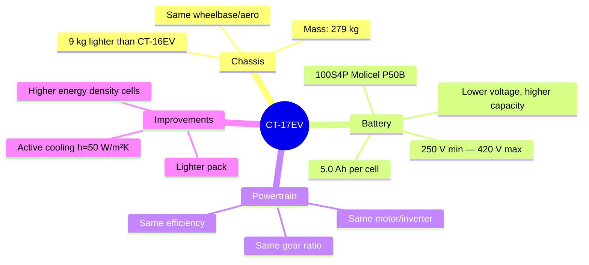

# CT-17EV (2026)

> [!tip] The Design Target
> The 2026 car currently being designed. The simulation's ultimate goal is to **optimize this car's configuration** for maximum competition points.

---

## Vehicle Specifications

---

## Key Parameters

| Parameter | CT-17EV | CT-16EV | Change |
|-----------|---------|---------|--------|
| Mass | 279 kg | 288 kg | **-9 kg** |
| Cell type | P50B | P45B | Higher energy |
| Cell capacity | 5.0 Ah | 4.5 Ah | **+11%** |
| Series cells | 100 | 110 | **-10 cells** |
| Pack voltage (max) | ~420 V | ~461 V | Lower |
| Pack voltage (min) | ~250 V | ~280 V | Lower |
| Active cooling | h=50 W/m²K | None | **New** |
| Motor/inverter | Same | Same | — |
| Gear ratio | 3.6363 | 3.6363 | — |
| Aero | Same | Same | — |

---

## What's Different

### Lighter Pack
10 fewer series cells × ~70g each = ~0.7 kg from cells alone. Total mass reduction is 9 kg (includes structural changes).

### Higher Energy Density
P50B cells are 5.0 Ah vs P45B's 4.5 Ah — **11% more energy per cell**. Despite having fewer cells, total pack energy is comparable or higher.

### Lower Voltage
100S vs 110S means ~9% lower pack voltage. This affects motor controller behavior and current draw (higher current for same power).

### Active Cooling
The CT-17EV adds a cooling system (h=50 W/m²K). This should significantly extend the thermal envelope, allowing sustained high-power operation that would overheat the CT-16EV.

> [!warning] Placeholder Values
> Some CT-17EV parameters are placeholders:
> - Cell voltage bounds (2.50–4.20V) are estimated pending P50B datasheet
> - Discharge limits are copied from P45B and need updating
> - Active cooling is modeled in Voltt data but not yet in the simulation code

---

## Competition Target

- **Event:** FSAE 2026 (~June 2026)
- **Goal:** Maximize endurance + efficiency points through simulation-guided optimization

See also: [[CT-16EV (2025)]], [[Vehicle Comparison]]
