# Vehicle Comparison

Side-by-side comparison of [[CT-16EV (2025)]] and [[CT-17EV (2026)]].

---

## Parameter Table

| Parameter | CT-16EV (2025) | CT-17EV (2026) | Advantage |
|-----------|---------------|---------------|-----------|
| **Mass** | 288 kg | 279 kg | CT-17EV (-3.1%) |
| **Cell Type** | Molicel P45B | Molicel P50B | CT-17EV |
| **Topology** | 110S4P | 100S4P | — |
| **Cell Capacity** | 4.5 Ah | 5.0 Ah | CT-17EV (+11%) |
| **Pack Capacity** | 18.0 Ah | 20.0 Ah | CT-17EV (+11%) |
| **Max Voltage** | 461.5 V | ~420 V | CT-16EV |
| **Min Voltage** | 280.5 V | ~250 V | CT-16EV |
| **Active Cooling** | None | h=50 W/m²K | CT-17EV |
| **Motor** | Same | Same | — |
| **Gear Ratio** | 3.6363 | 3.6363 | — |
| **Efficiency** | 92% | 92% | — |
| **Max Speed** | ~68 km/h | ~68 km/h | — |
| **Peak Force** | ~1,247 N | ~1,247 N | — |

---

## Expected Performance Impact

```mermaid
flowchart TD
    subgraph CT17["CT-17EV Advantages"]
        MASS["9 kg lighter<br/>→ lower rolling resistance<br/>→ better acceleration"]
        COOL["Active cooling<br/>→ sustained high power<br/>→ no thermal shutdown"]
        CAP["Higher pack capacity<br/>→ more total energy<br/>→ longer runs at full power"]
    end

    subgraph CT16["CT-16EV Advantages"]
        VOLT["Higher voltage<br/>→ lower current for same power<br/>→ less I²R loss"]
        DATA["Real telemetry<br/>→ validated model<br/>→ known performance"]
    end

    MASS --> FASTER["Faster lap times"]
    COOL --> FASTER
    CAP --> LONGER["More laps at full power"]
    VOLT --> EFF["Slightly more efficient"]
    DATA --> CONF["Higher confidence"]

    style CT17 fill:#2d4a22,stroke:#4a7c34
    style CT16 fill:#1a3a5c,stroke:#2d6da3
```

---

## Simulation Strategy

1. **Validate** the simulation against CT-16EV telemetry (known ground truth)
2. **Swap** parameters to CT-17EV configuration
3. **Compare** predicted performance
4. **Optimize** CT-17EV parameters (gear ratio, torque limits, regen strategy)
5. **Predict** competition points

See also: [[Roadmap]], [[System Overview]]
